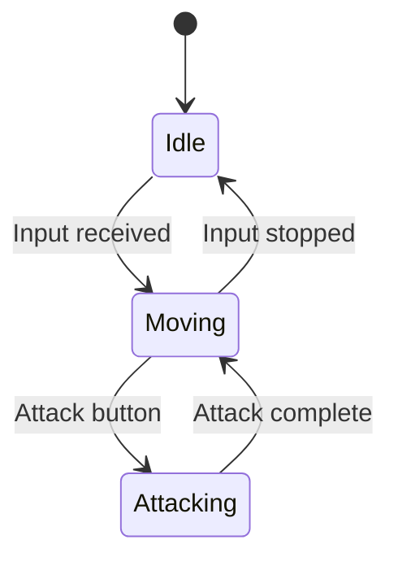

# Agent Ingestion Guide

This guide helps AI agents optimally parse, understand, and implement from OCTP documentation.

## Purpose

This documentation system is designed for **dual consumption**:
1. Human developers who need to understand the design
2. AI agents who need to implement the design

This guide focuses on #2 - how AI agents should read and use these documents.

## Quick Start for AI Agents

When asked to implement a feature:

```python
# Pseudocode workflow
def implement_feature(feature_name):
    # 1. Discover relevant documents
    manifest = parse_json("00-Meta/MANIFEST.json")
    docs = manifest.find_documents_by_keyword(feature_name)
    
    # 2. Load dependencies first
    for doc in docs:
        for dep_id in doc.dependencies:
            load_and_parse_document(manifest.get_doc_by_id(dep_id))
    
    # 3. Load main documents
    for doc in docs:
        load_and_parse_document(doc)
    
    # 4. Parse and extract
    goals = extract_goals(docs)
    constraints = extract_constraints(docs)
    steps = extract_implementation_steps(docs)
    success_criteria = extract_success_criteria(docs)
    
    # 5. Implement
    execute_steps(steps, constraints)
    
    # 6. Validate
    verify_success_criteria(success_criteria)
    
    # 7. Update documentation
    update_doc_status(docs, "Implemented")
    add_implementation_notes(docs)
```

## Document Discovery

### Primary: MANIFEST.json

Always start here. Structure:
```json
{
  "documents": [
    {
      "id": "unique-identifier",
      "path": "relative/path/to/doc.md",
      "title": "Human-readable title",
      "type": "game_design|technical|assets|reference|meta",
      "status": "draft|in_review|approved|implemented|deprecated",
      "priority": "critical|high|medium|low",
      "description": "Brief summary",
      "dependencies": ["other-doc-ids"],
      "related": ["related-doc-ids"]
    }
  ]
}
```

### Search Strategy

**By ID**: Direct lookup
```python
doc = manifest["documents"].find(d => d["id"] == "movement-system")
```

**By keyword**: Search title, description, path
```python
docs = manifest["documents"].filter(d => 
    "movement" in d["title"].lower() or 
    "movement" in d["description"].lower()
)
```

**By type**: Filter by document type
```python
game_design_docs = manifest["documents"].filter(d => d["type"] == "game_design")
```

**By status**: Only implement approved designs
```python
approved = manifest["documents"].filter(d => d["status"] == "approved")
```

## Document Parsing

### Section Order

Documents follow predictable structure:

1. **Metadata** (CRITICAL - parse first)
2. **Overview** (context setting)
3. **Goals** (what to achieve)
4. **Dependencies** (what to load first)
5. **Constraints** (limitations)
6. **Main Content** (implementation details)
7. **Success Criteria** (validation)
8. **Testing Strategy** (verification)
9. **Open Questions** (potential issues)
10. **Changelog** (history)

### Critical Sections for Implementation

```python
class DocumentParser:
    def parse_for_implementation(self, doc_path):
        doc = read_markdown(doc_path)
        
        return {
            "metadata": self.extract_metadata(doc),
            "goals": self.extract_bullet_list("## Goals", doc),
            "dependencies": self.extract_bullet_list("## Dependencies", doc),
            "constraints": self.extract_bullet_list("## Constraints", doc),
            "steps": self.extract_numbered_list("#### Implementation Steps", doc),
            "code_examples": self.extract_code_blocks(doc),
            "diagrams": self.extract_mermaid_diagrams(doc),
            "success_criteria": self.extract_checkboxes("## Success Criteria", doc),
            "open_questions": self.extract_bullet_list("## Open Questions", doc)
        }
```

### Metadata Parsing

Extract key-value pairs:
```markdown
## Metadata
- **Type**: Game Design
- **Status**: Approved
- **Version**: 1.2
```

Parse as:
```python
{
    "type": "game_design",
    "status": "approved",
    "version": "1.2"
}
```

**Status field is critical**:
- `draft`: Design not final, implementation may change
- `approved`: Safe to implement
- `implemented`: Already done, read for understanding
- `deprecated`: Don't implement, check for replacement

### Dependency Resolution

Before implementing, load dependencies:

```python
def load_with_dependencies(doc_id, manifest, loaded=set()):
    if doc_id in loaded:
        return
    
    doc = manifest.get_doc_by_id(doc_id)
    
    # Recursively load dependencies
    for dep_id in doc["dependencies"]:
        load_with_dependencies(dep_id, manifest, loaded)
    
    # Load this document
    parse_document(doc["path"])
    loaded.add(doc_id)
```

### Related Documents

"Related" docs provide additional context but aren't required:
```python
# Optional: Load related docs for fuller context
for related_id in doc["related"]:
    parse_document(manifest.get_doc_by_id(related_id)["path"])
```

## Extracting Implementation Details

### Goals Extraction

```markdown
## Goals
- Primary goal: Enable snake-like movement
- Secondary goal: Feel responsive and smooth
- Tertiary goal: Support 60+ FPS
```

Extract as:
```python
goals = [
    {"type": "primary", "text": "Enable snake-like movement"},
    {"type": "secondary", "text": "Feel responsive and smooth"},
    {"type": "tertiary", "text": "Support 60+ FPS"}
]
```

### Constraints Extraction

```markdown
## Constraints
- Must use Unity's Input System (not legacy)
- Maximum 10 party members in snake chain
- 2D movement only (no z-axis)
```

Parse as implementation requirements/limitations.

### Step-by-Step Instructions

```markdown
#### Implementation Steps
1. **Create PlayerController script** in `_Project/Player/Scripts/`
   - Inherit from MonoBehaviour
   - Add Rigidbody2D component requirement
2. **Implement movement input** using Input System
   - Subscribe to move action
   - Store direction vector
3. **Apply movement** in FixedUpdate
   - Calculate velocity from input
   - Apply to Rigidbody2D
```

Execute sequentially, respecting hierarchy and sub-steps.

### Code Example Usage

```markdown
#### Code Examples
```csharp
public class PlayerController : MonoBehaviour
{
    [SerializeField] private float _moveSpeed = 5f;
    private Rigidbody2D _rb;
    
    void Awake()
    {
        _rb = GetComponent<Rigidbody2D>();
    }
}
```
```

Use as:
1. **Template** - Starting point for implementation
2. **Reference** - Check naming conventions, patterns
3. **Validation** - Ensure implementation matches style

### Diagram Interpretation



Parse as:
1. **States** to implement (Idle, Moving, Attacking)
2. **Transitions** and their conditions
3. **Initial state** ([*] → Idle)

### Success Criteria Extraction

```markdown
## Success Criteria
- [ ] Player moves in 8 directions with WASD/Arrow keys
- [ ] Movement feels smooth at 60 FPS
- [ ] Party members follow in snake pattern
- [ ] No jittering or rubber-banding
```

Convert to validation tests:
```python
tests = [
    test_eight_direction_movement(),
    test_60fps_performance(),
    test_snake_following_pattern(),
    test_no_jittering()
]
```

## Implementation Strategy

### Context Window Management

AI agents have limited context. Prioritize:

1. **Load MANIFEST.json** (always fits, provides structure)
2. **Load target document** (the feature being implemented)
3. **Load critical dependencies** (Architecture.md, related systems)
4. **Skim related documents** (load only relevant sections)

### Handling Large Documents

For documents with many sections:
1. Parse table of contents
2. Load relevant sections only
3. Return to load more sections as needed

### Incremental Implementation

Follow document's numbered steps:
1. Implement step 1
2. Validate step 1
3. Implement step 2
4. Validate step 2
5. Continue...

Don't implement everything at once.

### Dealing with TBD Sections

```markdown
## Combat Timing
**TBD** - Need to playtest before finalizing
```

When encountering "TBD":
1. Note it in implementation
2. Use reasonable defaults
3. Flag for designer review
4. Add TODO comment in code

### Handling Open Questions

```markdown
## Open Questions
- **Q**: Should movement be grid-based or free-form?
  - *Status*: Under discussion
```

When questions exist:
1. Check if answer is in related docs
2. If approved doc, assume designer will resolve before expecting implementation
3. If implementing anyway, choose most reasonable option and document decision

## Validation and Feedback

### Success Criteria Validation

After implementation:
```python
for criterion in success_criteria:
    result = validate(criterion)
    if not result.passed:
        log_failure(criterion, result.reason)
```

Report which criteria passed/failed.

### Implementation Notes

Update document with:
```markdown
## Implementation Notes
- **Implemented**: 2026-02-08
- **Files**: 
  - `Assets/_Project/Player/Scripts/PlayerController.cs`
  - `Assets/_Project/Player/Scripts/PlayerMovement.cs`
- **Deviations**: 
  - Used Vector2 instead of Vector3 for 2D (constraint)
  - Added diagonal movement smoothing (enhancement)
- **Issues**:
  - Frame rate drops below 60 FPS with 10+ party members (performance criterion not met)
```

### Status Updates

After successful implementation:
1. Change document status: `approved` → `implemented`
2. Update MANIFEST.json status
3. Add changelog entry
4. Link to actual code files

## Advanced Patterns

### Cross-Document References

```markdown
See [Movement System](../01-GameDesign/Movement_System.md#snake-pattern) for details.
```

Follow links when:
1. Current document lacks detail
2. Reference is to section with implementation steps
3. Validation requires understanding referenced system

### Handling Conflicts

If two documents contradict:
1. Check document versions (higher version wins)
2. Check status (Approved > Draft)
3. Check dates (newer wins)
4. Report conflict for designer resolution

### Diagram-Driven Development

Use diagrams as primary source:
1. Extract states/classes/flows from diagram
2. Implement structure matching diagram
3. Fill in logic from text documentation
4. Validate implementation matches diagram

## Performance Optimization

### Parsing Efficiency

1. **Cache MANIFEST.json** - Load once per session
2. **Parse metadata only** for filtering
3. **Lazy load content** - Only when needed
4. **Extract sections** - Don't load whole document

### Context Optimization

1. **Summarize** loaded documents for later reference
2. **Extract key facts** - Store goals, constraints, steps
3. **Discard examples** after understanding patterns
4. **Link to original** instead of copying full content

## Common Pitfalls

### ❌ Don't
- Implement from Draft status documents
- Skip dependency loading
- Ignore constraints
- Implement all at once without validation
- Forget to update document status

### ✅ Do
- Check status is "Approved" before implementing
- Load dependencies in order
- Respect all constraints
- Implement incrementally with validation
- Update documentation after implementation

## Example Workflow

See [WORKFLOW.md](WORKFLOW.md) for human workflow.

For AI agents:
1. Parse MANIFEST.json
2. Find relevant approved documents
3. Load dependencies recursively
4. Extract implementation details
5. Execute steps sequentially
6. Validate against success criteria
7. Update document status and notes

## Questions?

If documentation is unclear:
1. Check related documents
2. Check glossary for terms
3. Look for code examples
4. Note in implementation that clarification needed
5. Flag open question in document

---

*This guide is versioned with the documentation system. Last Updated: 2026-02-08 | Version: 1.0*
