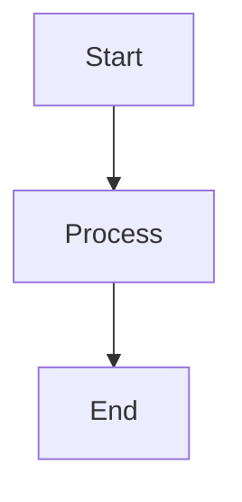
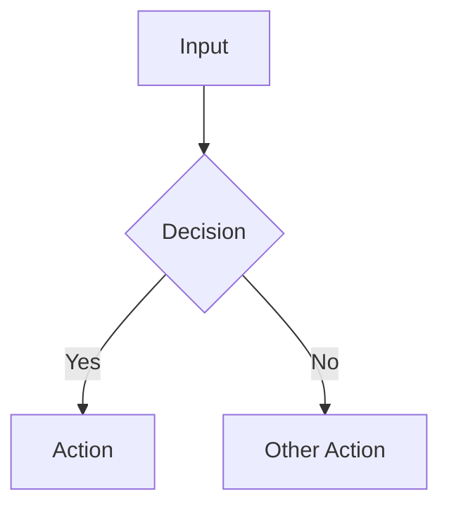
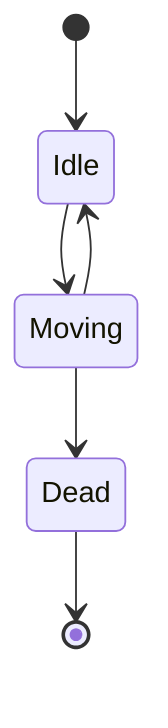
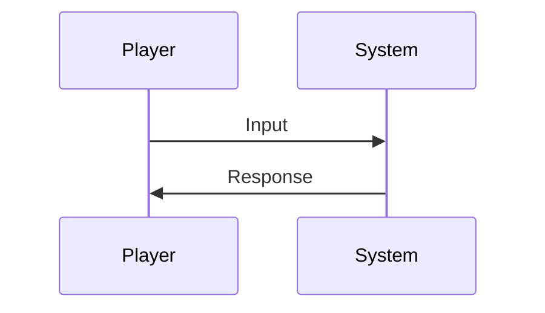
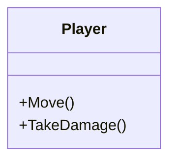

# Documentation Style Guide

This guide ensures consistency and AI-agent optimization across all OCTP documentation.

## Document Structure

Every design document MUST include these sections in order:

### 1. Title (H1)
```markdown
# [Document Title]
```

### 2. Metadata Section
```markdown
## Metadata
- **Type**: [Game Design | Technical Design | Assets | Reference | Meta]
- **Status**: [Draft | In Review | Approved | Implemented | Deprecated]
- **Version**: X.Y (increment minor for updates, major for rewrites)
- **Last Updated**: YYYY-MM-DD
- **Owner**: [Primary author/maintainer]
- **Related Docs**: [id1, id2] (use IDs from MANIFEST.json)
```

### 3. Overview
2-3 sentence summary. Answer: "What is this document about?"

### 4. Goals
Bulleted list of objectives. What should be achieved?

### 5. Dependencies
What must exist before this can be implemented?
- Other systems
- Documents to read first
- Prerequisites

### 6. Constraints
Limitations and boundaries:
- Technical constraints
- Design constraints
- Scope boundaries

### 7. Main Content Sections
Use descriptive H2/H3 headers. Each major section should follow this pattern:

```markdown
### [Feature Name]

**What**: Brief description of what this is
**Why**: Rationale and purpose
**How**: Implementation approach

#### Flow Diagram (when applicable)


#### Implementation Steps
1. **Step 1**: Detailed instruction with context
   - Sub-detail if needed
2. **Step 2**: Next instruction
3. ...

#### Code Examples (for technical docs)
```csharp
// Clear, commented example code
public class Example {
    // Explanation
}
```
```

### 8. Success Criteria
Measurable checkboxes:
```markdown
## Success Criteria
- [ ] Can do X
- [ ] Achieves Y performance
- [ ] Passes Z test
```

### 9. Testing Strategy (technical docs)
How to verify this works correctly.

### 10. Open Questions
Unresolved design issues:
```markdown
## Open Questions
- **Q1**: What should happen when...?
  - *Status*: Under discussion
- **Q2**: How do we handle...?
  - *Status*: Needs research
```

### 11. Changelog
Track document evolution:
```markdown
## Changelog
- **v1.2** (2026-02-08): Added combat timing details
- **v1.1** (2026-02-01): Updated movement speed
- **v1.0** (2026-01-15): Initial version
```

## Formatting Standards

### Headers
- Use sentence case: "Movement system" not "Movement System"
- Be descriptive: "How the player controls the snake" not "Controls"
- Max 3 levels deep (H1, H2, H3)

### Lists
- Use `-` for unordered lists
- Use `1.` for ordered/sequential lists
- Use `- [ ]` for checkboxes
- Always use consistent indentation (2 spaces)

### Code Blocks
- Always specify language: \`\`\`csharp not \`\`\`
- Include comments explaining non-obvious code
- Keep examples focused and minimal
- Use actual project namespaces: `OCTP.Player` not `Example.Player`

### Links
- Use relative paths: `../01-GameDesign/GDD_Core.md`
- Reference document IDs in related docs: `[movement-system, party-system]`
- External links: full URLs with descriptive text

### Diagrams
Use Mermaid for all diagrams. Common types:

**Flowcharts**:


**State Machines**:


**Sequence Diagrams**:


**Class Diagrams** (for technical docs):


## Writing Style

### Voice and Tone
- **Active voice**: "The system checks..." not "It is checked..."
- **Present tense**: "The player moves" not "The player will move"
- **Direct and clear**: Avoid ambiguity
- **Technical precision**: Use exact terms (see Glossary)

### Dos and Don'ts

✅ **DO**:
- Write for both humans and AI agents
- Include rationale ("why") not just specification ("what")
- Use concrete examples
- Cross-reference related documents
- Update changelog when editing
- Increment version numbers

❌ **DON'T**:
- Use vague language ("probably", "maybe", "around")
- Skip sections (use "TBD" if needed)
- Create orphan documents (not in MANIFEST.json)
- Forget to update "Last Updated" date
- Use screenshots (they can't be parsed by AI; use text/diagrams)

## AI Agent Optimization

### Context Engineering
Structure content for optimal AI comprehension:

1. **Front-load important info**: Goals and constraints come before details
2. **Hierarchical organization**: Use clear section nesting
3. **Explicit relationships**: State dependencies clearly
4. **Step-by-step instructions**: Number sequential actions
5. **Validation criteria**: Provide testable success conditions

### Keywords for AI Parsing
Use these consistently:
- **MUST**: Absolute requirement
- **SHOULD**: Strong recommendation
- **MAY**: Optional
- **TBD**: To be determined
- **DEPRECATED**: No longer valid
- **CRITICAL**: Blocks other work

### Machine-Readable Metadata
Always complete the metadata section fully. AI agents parse this first.

## File Naming

### Markdown Files
- Use underscores: `Movement_System.md` not `movement-system.md`
- Capitalize major words: `Party_System.md`
- Match the document title (minus special chars)

### Images/Diagrams
- Descriptive names: `party-system-flow.png`
- Include document reference: `movement-system-state-machine.png`
- Store in `images/` subfolder within same directory

## Maintenance

### When to Update
- Design changes or refinements
- Implementation reveals issues
- Questions get answered
- New dependencies identified

### Update Process
1. Edit the document
2. Update "Last Updated" date
3. Add changelog entry
4. Increment version (minor for updates, major for rewrites)
5. Update status if needed (Draft → In Review → Approved)
6. Update MANIFEST.json if doc ID/path/status changes

### Review Cycle
- **Draft**: Author creates initial version
- **In Review**: Team/stakeholders review
- **Approved**: Design finalized, implementation can begin
- **Implemented**: Code matches design (link to implementation)

## Examples

See existing documents in `01-GameDesign/` for reference implementations.

## Questions?

Check [WORKFLOW.md](WORKFLOW.md) for procedural questions or [AGENT_INGESTION.md](AGENT_INGESTION.md) for AI-specific concerns.

---

*Last Updated: 2026-02-08 | Version: 1.0*
