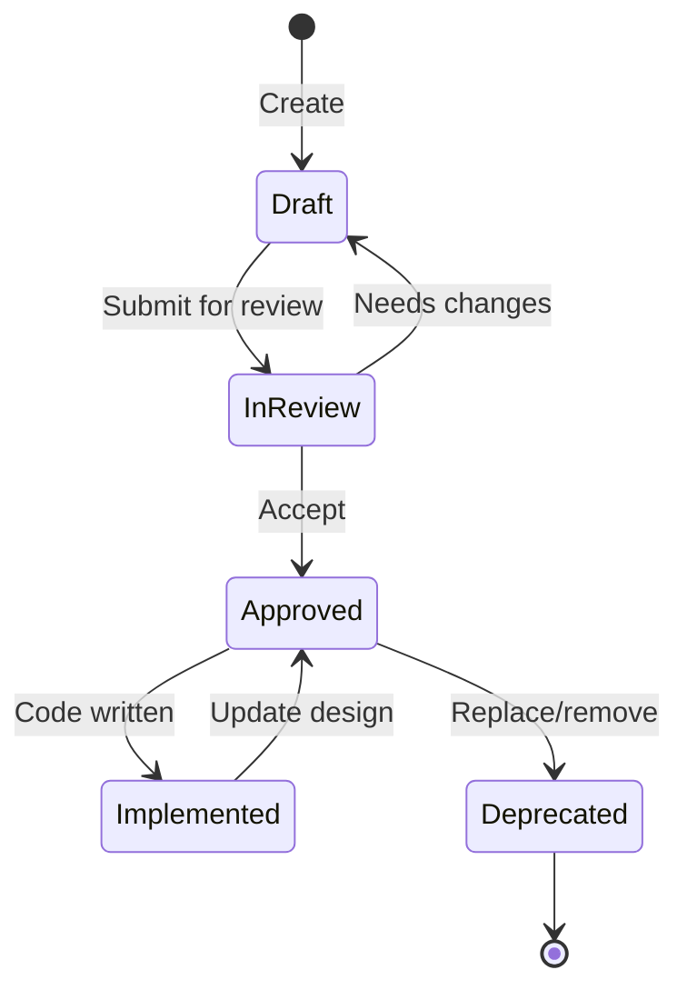

# Documentation Workflow

This document describes how to create, update, and maintain OCTP documentation.

## Quick Start

### Creating a New Document

1. **Check MANIFEST.json** - Does this document already exist?
2. **Determine category** - Where does it belong?
   - `00-Meta/` - Documentation system guides
   - `01-GameDesign/` - Game mechanics and design
   - `02-TechnicalDesign/` - Technical implementation
   - `03-Assets/` - Art/audio requirements
   - `04-Reference/` - Research and glossary

3. **Create document** using [STYLE_GUIDE.md](STYLE_GUIDE.md) template
4. **Add to MANIFEST.json**:
   ```json
   {
     "id": "unique-id",
     "path": "01-GameDesign/My_Document.md",
     "title": "Document Title",
     "type": "game_design",
     "status": "draft",
     "priority": "medium",
     "description": "Brief description",
     "dependencies": ["other-doc-id"],
     "related": ["related-doc-id"]
   }
   ```
5. **Link from README** if it's a major document
6. **Commit changes** with message: `docs: Add [document name]`

### Updating an Existing Document

1. **Open the document**
2. **Make your changes**
3. **Update metadata**:
   - Increment version (1.0 → 1.1 for minor, 1.0 → 2.0 for major rewrite)
   - Update "Last Updated" date
   - Add changelog entry at bottom
4. **Update status** if appropriate (Draft → In Review → Approved)
5. **Update MANIFEST.json** if status/priority changed
6. **Commit changes** with message: `docs: Update [document name] - [what changed]`

### Reviewing a Document

1. **Check completeness**:
   - All required sections present?
   - Metadata filled out?
   - Examples provided?
   - Diagrams where needed?

2. **Check clarity**:
   - Can someone implement this without asking questions?
   - Are goals and constraints clear?
   - Are dependencies listed?

3. **Check consistency**:
   - Follows STYLE_GUIDE.md?
   - Terminology matches Glossary?
   - Cross-references correct?

4. **Provide feedback**:
   - Add comments as "Open Questions"
   - Suggest changes in review
   - Change status to "In Review" if not ready

5. **Approve**:
   - Change status to "Approved" when ready
   - Update MANIFEST.json

## Document Lifecycle



### Status Definitions

- **Draft**: Initial creation, work in progress, subject to change
- **In Review**: Ready for team/stakeholder review
- **Approved**: Design finalized, ready for implementation
- **Implemented**: Code exists that matches this design
- **Deprecated**: No longer valid, kept for historical reference

## Priority Levels

Assign priority based on implementation order:

- **Critical**: Must have for MVP, blocks other work
- **High**: Important for core gameplay experience
- **Medium**: Enhances the game but not essential
- **Low**: Nice to have, polish, future considerations

## Working with AI Agents

### Before Implementation

AI agents should:
1. **Read MANIFEST.json** to discover relevant documents
2. **Load dependencies** listed in document metadata
3. **Parse goals and constraints** for context
4. **Follow implementation steps** sequentially
5. **Validate against success criteria**

### After Implementation

AI agents should:
1. **Update document status** to "Implemented"
2. **Add implementation notes** to changelog
3. **Link to actual code** in the document
4. **Note any deviations** from the design
5. **Flag open questions** that arose during implementation

### Document-Driven Development

1. **Design first**: Write or update design doc
2. **Review**: Get approval if needed
3. **Implement**: AI agent reads doc and implements
4. **Validate**: Check against success criteria
5. **Update**: Note implementation in doc

## Templates

### Minimal Template (for simple docs)
```markdown
# [Title]

## Metadata
- **Type**: [type]
- **Status**: Draft
- **Version**: 1.0
- **Last Updated**: YYYY-MM-DD
- **Owner**: [name]
- **Related Docs**: []

## Overview
[2-3 sentences]

## Goals
- Goal 1
- Goal 2

## [Main Content]
[Content here]

## Changelog
- v1.0 (YYYY-MM-DD): Initial version
```

### Full Template
See [STYLE_GUIDE.md](STYLE_GUIDE.md) for the complete template with all sections.

## Common Tasks

### Adding a New Game Feature

1. Create game design doc in `01-GameDesign/`
2. Create technical design doc in `02-TechnicalDesign/`
3. Update Architecture.md with new system
4. Add to MANIFEST.json (both docs)
5. Link related documents
6. Create asset requirements in `03-Assets/` if needed

### Documenting Existing Code

1. Create technical doc describing the implementation
2. Set status to "Implemented"
3. Link to actual code files
4. Note any deviations from original design
5. If no design existed, create retroactive game design doc

### Deprecating Old Design

1. Change status to "Deprecated"
2. Add note explaining why (in a new section at top)
3. Link to replacement document if applicable
4. Update MANIFEST.json status
5. Keep file for historical reference

## Best Practices

### For Game Designers
- Start with "why" before "what"
- Include player experience goals
- Provide concrete examples
- Consider edge cases
- Think about failure states

### For Technical Designers
- Specify data structures clearly
- Include performance considerations
- Provide code examples
- Note Unity-specific requirements
- Consider testing strategy

### For Asset Creators
- Be specific about requirements
- Include style references
- Specify technical constraints (resolution, format, etc.)
- Estimate quantities
- Note variations needed

## Collaboration

### Working as a Team
- Use branches for major doc updates
- Review each other's documents
- Discuss open questions together
- Keep MANIFEST.json in sync

### Working with AI Agents
- Write clear, unambiguous instructions
- Include step-by-step procedures
- Provide validation criteria
- Update docs based on implementation feedback

## Tools

### Recommended Editors
- **VS Code**: Markdown preview, Mermaid extension
- **Obsidian**: Graph view for document relationships
- **GitHub**: Web editor for quick updates

### Validation
- Check JSON syntax: `jsonlint MANIFEST.json`
- Preview Mermaid: [mermaid.live](https://mermaid.live)
- Spellcheck: Use editor plugins

## Troubleshooting

**Q: AI agent can't find my document**
- Check it's added to MANIFEST.json
- Verify path is correct
- Ensure file exists at specified path

**Q: AI agent ignores my design**
- Check status is "Approved" not "Draft"
- Verify success criteria are clear
- Ensure implementation steps are numbered

**Q: Document seems incomplete**
- Use STYLE_GUIDE.md checklist
- Fill in all required sections
- Mark sections "TBD" if unknown

**Q: Don't know where to add something**
- Check existing similar documents
- Ask in open questions
- Default to 04-Reference/ for unsure items

## Version Control

### Commit Messages
Use conventional commits format:
```
docs: Add movement system design
docs: Update party system with new mechanics
docs: Fix typo in combat implementation
docs: Deprecate old progression system
```

### What to Commit
- ✅ All .md files
- ✅ MANIFEST.json
- ✅ Diagram source files
- ✅ Referenced images
- ❌ Editor temp files
- ❌ Personal notes

## Questions?

- **Style questions**: See [STYLE_GUIDE.md](STYLE_GUIDE.md)
- **AI agent questions**: See [AGENT_INGESTION.md](AGENT_INGESTION.md)
- **Term definitions**: See [04-Reference/Glossary.md](../04-Reference/Glossary.md)

---

*Last Updated: 2026-02-08 | Version: 1.0*
