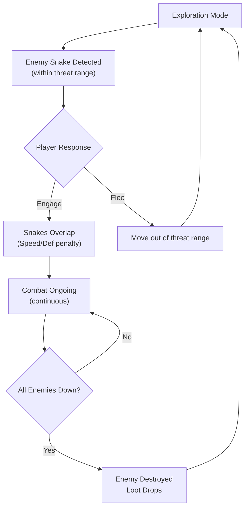
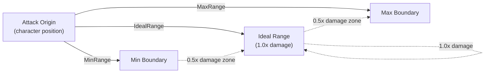

# Combat System Design

## Metadata
- **Type**: Game Design
- **Status**: Draft
- **Version**: 1.1
- **Last Updated**: 2026-02-08
- **Owner**: OCTP Team
- **Related Docs**: [gdd-core, movement-system, party-system, combat-impl]

## Overview

There is **no discrete "combat mode"** in OCTP. Combat occurs continuously in the open world when player and enemy snakes interact. When snakes overlap, overlapping characters suffer Speed/Defense penalties, but both snakes continue auto-advancing. Snakes are destroyed only when all members are downed.

## Combat Flow



**Key Difference from Traditional Combat**:
- No transition to separate combat scene
- Movement continues during combat
- Player can flee by moving out of enemy threat range
- Multiple enemy snakes can be engaged simultaneously

## Goals

- Real-time tactical combat where positioning directly impacts effectiveness
- Clear feedback on ability targeting and range
- Skill-based positioning encourages player agency
- Balanced pacing that maintains tension without overwhelming complexity

## Dependencies

- **Core GDD** - Combat modes and overall flow
- **Movement System** - How positioning works
- **Party System** - Character abilities and stats

## Constraints

- Real-time only (no turn-based)
- Must support 60 FPS with simultaneous combat
- Ability range values must be designer-tunable
- Combat auto-balances via enemy budget system

## Core Combat Mechanics

### Attack Types

#### Auto-Attacks

**Definition**: Attacks that trigger automatically based on conditions (range, cooldown)

**Triggering**:
1. Check if ability is off cooldown
2. Find all enemies in attack's minimum-to-maximum range
3. Filter to only those within **ideal range** first
4. If multiple targets at ideal range, pick **nearest**
5. If no targets at ideal range, pick nearest overall
6. If no targets in range, attack waits for cooldown to reset

**Damage Scaling**:
```
Ideal Range (1.0x damage)
  ^
  |
0.75x damage
  |
0.5x damage (Minimum/Maximum range edge)
```

Damage scales linearly from 0.5x at min/max range to 1.0x at ideal range.

**Characteristics**:
- Cannot be player-controlled (automatic)
- All active combatants have at least one auto-attack
- Some characters have multiple auto-attacks (e.g., warrior with sword + bow)
- Cooldown timer resets after firing

**Range Values**:
```csharp
public class AutoAttack
{
    public float MinimumRange;   // e.g., 0.5
    public float IdealRange;     // e.g., 2.5
    public float MaximumRange;   // e.g., 4.0
    public float Cooldown;       // e.g., 1.0 second
    public float BaseDamage;     // Scaled by stats
}
```

#### Passive Abilities

**Definition**: Abilities that provide constant effects or periodic triggers

**Examples**:
- "All allies gain +10% defense" (constant effect)
- "Every 3 seconds, heal self for 5% max HP" (pulse timer)
- "Reduce damage taken from melee attacks by 25%" (conditional)
- "If any ally is downed, increase snake speed by 10%" (conditional)

**Characteristics**:
- Always active, no player control
- Can be permanent or pulse-based
- Can affect self, nearby allies, or entire snake
- Some may have conditions (e.g., "when downed ally present")

#### Active Abilities

**Definition**: Player-triggered abilities with cooldowns

**Examples**:
- "Deal 50 damage to nearest enemy" (single target burst)
- "Create shield equal to 30% max HP for entire snake" (defensive)
- "Revive nearest downed ally, restore 50% their HP" (support)
- "Rush forward 2 units, stunning enemies in the way" (movement+control)

**Triggering**:
- Player presses hotkey (1-9 on PC, on-screen button on mobile, radial on controller)
- Ability must be off cooldown
- Optional: may have resource cost (mana, stamina - TBD)

**Characteristics**:
- Player-controlled, discretionary
- Each character can have 0-3 active abilities
- Each has independent cooldown timer
- Can affect single target, area, or entire snake
- May have movement component

### Range and Positioning

#### Attack Range Calculation

Each attack has three range values:



#### Positioning Advantage

**Scenario 1**: Maintaining Ranged DPS optimal range while melee enemies miss

```
Ally Ranged Attacker (ideal range 3.5 units)
Enemy Melee Attacker (ideal range 0.8 units)

Distance: 3.5 units
Result: Ally deals 1.0x damage, Enemy deals 0.5x damage
Advantage: Ally
```

**Scenario 2**: Melee vs Melee

```
Ally Melee (ideal range 0.8 units)
Enemy Melee (ideal range 0.8 units)

Distance: 0.8 units
Result: Both deal 1.0x damage
Advantage: Whoever has higher damage output
```

**Scenario 3**: Overwhelmed by multiple enemies

```
Ally Sword User (range 0.8-2.0)
Enemies: 3 close + 2 ranged far away

Problem: Cannot hit ranged enemies from position
Solution: Reposition snake or use area ability
```

### Enemy Aggression & Threat System

### Threat Range (Aggro)
Each enemy snake has a **maximum threat range** (designer-tunable per enemy type):
- Enemy detects player snake entering range
- Enemy pathfinds toward player using own auto-advance
- Player stays outside threat range: Enemy ignores player
- Player enters threat range: Enemy engages

**Aggro Loss**:
- Player moves >threat_range + buffer_percentage away
- Enemy "forgets" about player and resumes idle behavior
- Enables escape without returning to safe zone

### Multiple Enemy Engagement
Possible to have multiple enemy snakes active simultaneously:
- Can overlap with 1st enemy, flee, encounter 2nd enemy
- Managing multiple threats creates dynamic challenge
- Enemy AI should pathfind around both obstacles AND other snakes

### Escape Abilities
Characters may have abilities to facilitate escape:
- **Dash** (active): Temporarily boost snake speed to break away
- **Stealth** (active): Reduce nearby enemy threat range perception
- **Distract** (passive): Draw enemy aggro away from party
- Other utility abilities TBD

## Damage Calculation

```csharp
public float CalculateDamage(
    AutoAttack attack,
    Character attacker,
    Character defender,
    float distance)
{
    // Base damage from attacker's stats
    float baseDamage = attack.BaseDamage;
    baseDamage *= GetStatMultiplier(attacker, attack.Type);
    
    // Range modifier (0.5x to 1.0x)
    float rangeModifier = GetRangeModifier(distance, attack);
    
    // Defensive stats
    float defenseReduction = GetDefenseReduction(defender, attack.Type);
    
    // Luck factor (tiny)
    float luckModifier = 1.0f + (attacker.Luck * 0.001f);
    
    float finalDamage = baseDamage * rangeModifier * defenseReduction * luckModifier;
    return Mathf.Max(1, finalDamage); // Minimum 1 damage
}
```

### Friendly Fire

**All abilities are team-safe** in OCTP. Offensive and support abilities cannot damage, stun, or negatively affect party members:

- **Offensive abilities** deal damage only to enemies
- **Support abilities** (heals, buffs) affect only allies
- **Area-of-effect abilities** are smart-targeted and exclude allies
- **Debuff abilities** (Slow, Poison, Weak) affect only enemies

**Rationale**: Simplifies combat logic, allows aggressive ability use without tactical punishment, and enables aggressive party compositions.

## Status Effects (FINALIZED)

OCTP MVP includes **6 core status effects** for combat depth and strategic variety:

### Negative Effects (Debuffs)
- **Slow**: Snake speed reduced by X% for duration (applied on hit by certain abilities)
- **Poison**: Damage per second for duration (stacks with multiple applications)
- **Weak**: Damage output reduced by X% for duration (multiplicative with base damage)

### Positive Effects (Buffs)
- **Haste**: Snake speed increased by X% for duration (stacks with other movement modifiers)
- **Regen**: Healing per second for duration (does not stack; only strongest buff applies)
- **Protect**: Damage reduction by X% for duration (blocks percentage of incoming damage)

## Ability Cooldown Management

Each ability has independent cooldown:

```
Ability Cooldowns on PC (Hotkeys 1-9):
1: Skill 1 [████████░░] 0.5s remaining
2: Skill 2 [█████░░░░░] 1.2s remaining
3: Skill 3 [██████████] READY
4: Skill 4 [███░░░░░░░] 2.1s remaining
...
```

**Player Skill**: Timing abilities to trigger when cooldown aligns, maintaining uptime/effectiveness.

## Combat Pacing

### Micro-Level (per second)

```
- Auto-attacks trigger on regular cadence (1-2 per second per character)
- Player can activate 1-2 active abilities per second (if cooldowns allow)
- Both snakes are continuously applying pressure
- Positioning shifts occur constantly as snake follows steering input
```

### Macro-Level (encounter duration)

**Short Combat** (10-15 seconds):
- Quick skirmish with single weak enemy
- Limited ability usage needed
- Mostly auto-attack based

**Medium Combat** (30-60 seconds):
- Multiple enemies or single tougher enemy
- Active abilities provide key advantage
- Positioning matters significantly

**Long Combat** (90+ seconds):
- Boss or multiple enemy snakes
- Cooldown management critical
- Positioning and ability timing determine victory
- Player resource management (HP, active ability strategy) tested

## Snake States & Defeat Mechanics

### Partial Defeat (Some Members Downed)

When some characters in a snake reach 0 HP:

**Visual State**:
```
Snake: [A - Healthy] [B - Healthy] [C - Downed] [D - Healthy]
       (acts)        (acts)        (inert)     (acts)
```

**Mechanical Effects**:
- Downed characters cannot attack, activate abilities, or contribute to passive abilities
- Downed character stats are reduced by 90% (minimal contribution to snake stats)
- This reduces the whole-snake stats (speed affected most)
- Snake continues moving, but weakened and slower
- Non-downed characters attack/defend normally as if downed members don't exist

**Recovery**:
- Healing abilities can restore downed characters to health (revive them)
- Only non-downed characters can heal others
- Any ability with 'revive' tag can resurrect downed allies during combat
- Healing orbs collected in world apply immediately to nearest damaged character

### Full Defeat (Snake Destroyed)

When **ALL characters** in a snake are downed:
- Snake is removed from world immediately
- Full loot burst drops at defeat location
- For enemy snakes: Removed and no longer a threat
- For player snake: Game over / session ends

**Loot Drops**:
- Gold (amount scales with total enemy power)
- Experience Orbs (distributed to surviving party members)
- Equipment/Items (rarity scales with enemy difficulty)
- Materials (crafting resources)
- Healing Orbs (activate immediately)

### Multiple Downed Characters

Example: A 5-member snake with 3 downed:

```
Snake: [A-Downed] [B-Downed] [C-Healthy] [D-Downed] [E-Healthy]

Stats Calculation:
Base Speed (sum of all): 60
  - A downed: 0 contribution
  - B downed: 0 contribution
  - C healthy: 20 contribution
  - D downed: 0 contribution
  - E healthy: 20 contribution
  = 40 speed (33% of original)

Consequence: Snake moves at ~67% normal speed (penalty compounds with each downed)
```

### Escape & Retreat

If player snake becomes heavily damaged or outnumbered:
1. **Option 1**: Flee from enemy threat range (enemies give up pursuit after buffer)
2. **Option 2**: Use Dash or Stealth ability to break engagement
3. **Option 3**: Retreat toward safe zone (if not too far)

If player successfully retreats to safe zone:
- All damage remains (can heal in zone)
- Downed members stay downed until healed or revived
- Collected loot is banked (safety achieved)

If player dies before reaching safety:
- All collected loot in that session is lost
- Party returns to last safe zone with no progression

### Player Victory
All enemy characters are downed. Loot drops:
- Gold (amount scales with enemy difficulty)
- XP (distributed evenly to party)
- Item drops (from boss enemies or treasure)
- Healing orbs (activate immediately if player needs)

### Player Defeat
All player characters are downed. 
- Party remains downed in exploration mode
- Player can attempt to leave zone to retreat to safe zone
- If player dies before reaching safe zone, run ends (loss all collected loot)

## Success Criteria

- [ ] Combat feels fast-paced and responsive (< 100ms action-to-effect)
- [ ] Positioning creates meaningful tactical choices
- [ ] Range and damage scaling is intuitive (players understand why attacks hit/miss)
- [ ] Difficulty scales appropriately with player power
- [ ] No single "optimal" strategy (multiple valid approaches)
- [ ] Combat lasts 30-120 seconds on average
- [ ] Players understand combat system within first encounter
- [ ] No ability is overpowered or useless

- **Status Effects**: ✅ RESOLVED - 6 core effects in MVP (Slow, Haste, Poison, Regen, Weak, Protect)
- **Resource System**: ✅ RESOLVED - Cooldowns only (no mana/energy)
- **Escape Mechanic**: ✅ RESOLVED - Active escape via outpacing threat range or reaching safe zone
- **Friendly Fire**: ✅ RESOLVED - Disabled; all abilities are team-safe
- **Resurrection**: ✅ RESOLVED - Any ability with 'revive' tag works mid-combat

## Changelog

- **v1.1** (2026-02-09): Finalized combat design - status effects (6 core), escape mechanic (spatial), friendly fire (disabled), resurrection (revive tag), downed penalty (90%)
- **v1.0** (2026-02-08): Initial combat system design

---

*Combat is the heart of OCTP — see Combat_Implementation.md for technical specs.*
