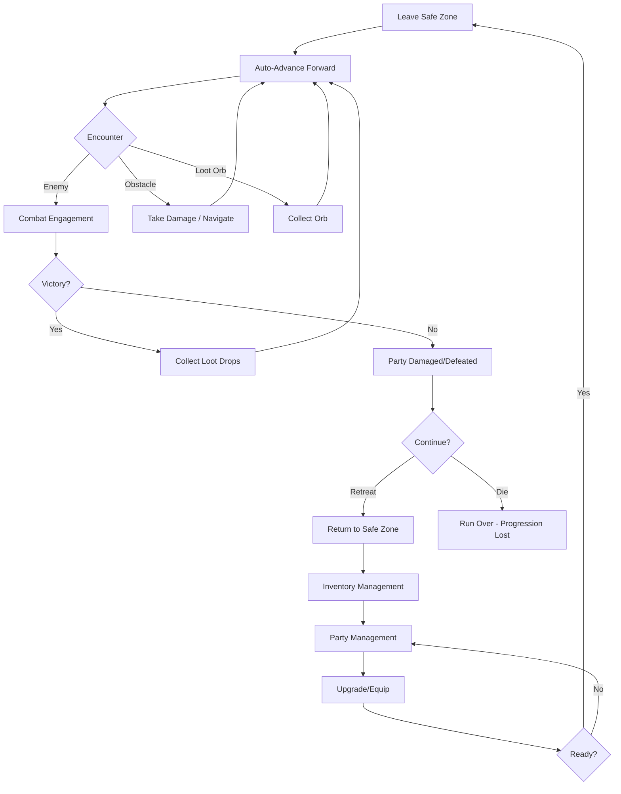

# Core Game Design Document

## Metadata
- **Type**: Game Design
- **Status**: Draft
- **Version**: 1.0
- **Last Updated**: 2026-02-08
- **Owner**: OCTP Team
- **Related Docs**: [movement-system, party-system, combat-system, ui-ux]

## Overview

OCTP is a top-down, real-time 2D action-roguelike where players control a snake-like formation of party members. Unlike traditional Snake, each link in the chain is a unique character with abilities, stats, and combat roles. The core challenge is **tactical positioning** — maneuvering your snake formation to maximize outgoing damage while minimizing incoming damage, all while maintaining constant forward momentum through the level. Defeated enemies drop loot orbs that fuel character progression at safe zones.

## Goals

### Primary Goals
- Create engaging snake-like movement that feels unique and strategic
- Build satisfying party management with meaningful character choices
- Deliver fast-paced real-time combat that leverages the snake formation
- Provide progression systems that encourage experimentation and replayability

### Secondary Goals
- Accessible controls for new players while offering depth for veterans
- Visual clarity despite potentially many on-screen characters
- Balanced difficulty curve that rewards skill and strategy
- Modular design allowing content expansion

### Player Experience Goals
- **Movement**: "My party is an extension of my will"
- **Combat**: "Position and timing matter"
- **Progression**: "I want to try different party compositions"
- **Overall**: "One more run..."

## Core Pillars

### 1. Snake Formation Movement
The party exists as a snake chain where each link is a recruited character. The snake **continuously advances forward** when outside safe zones:
- **Direction Control**: Player aims/directs snake movement in any direction
- **Auto-Advance**: Default behavior outside safezones; unstoppable momentum
- **Strategic Formation**: Position the snake to maximize ability range overlap, minimize enemy damage

See: [Movement_System.md](Movement_System.md)

### 2. Real-Time Tactical Combat
Fast-paced action where **positioning directly impacts combat effectiveness**:
- **Character Abilities**: Each character has auto-attacks, passive abilities, and active (player-controlled) abilities
- **Targeting**: Auto-attacks automatically target enemies in range; player chooses which active abilities to trigger via hotkeys
- **Cooldown Management**: All abilities have cooldowns; player manages cooldown staggering
- **Positioning Advantage**: Maintain distance to keep ranged allies in range while melee enemies miss; use obstacles for cover

See: [Combat_System.md](Combat_System.md)

### 3. Party Building & Progression
Recruit diverse characters and progress through loot collection:
- **Character Variety**: Different classes with unique stats, abilities, attack speeds/ranges
- **Loot Collection**: Defeat enemies to collect gold, XP, resources, and healing orbs
- **Safe Zones**: Manage party composition, equip items, and spend resources only in camps/towns
- **Immediate Healing**: Healing orbs activate instantly when collected; other loot waits until safe zone

See: [Party_System.md](Party_System.md)

## Target Audience

### Primary Audience
- **Action game fans** who enjoy reflex-based gameplay
- **Roguelike enthusiasts** attracted to build variety and replayability
- **Strategy players** who like tactical positioning

### Secondary Audience
- **Casual players** seeking accessible but deep gameplay
- **Mobile gamers** (potential platform expansion)

### Demographics
- Age: 16-35 (primary), 12-45 (secondary)
- Platforms: PC (initial), Console/Mobile (future)
- Session length: 15-45 minutes per run

## Game Modes

### Exploration Mode
**Location**: Outside safezones (dungeons, wilderness, etc.)
**Key Mechanics**:
- Snake auto-advances forward continuously (player cannot stop it, only steer)
- Collision with obstacles damages snake
- Encounters with enemy snakes trigger combat
- Loot orbs drop from defeated enemies and remain until collected
- Party composition is **locked** (cannot recruit/swap mid-exploration)

### Combat (Real-Time)
Combat triggers automatically when player snake encounters enemy snake. Combat ends when:
- Enemy snake is defeated
- Player snake is defeated (game over)
- Player escapes (if escape mechanic exists)

**Combat Mechanics**:
- Both player and enemy snakes are active simultaneously
- Auto-attacks trigger automatically based on range/cooldown
- Player manually activates active abilities via 1-9 keys (PC/mobile buttons/controller radial)
- Positioning determines which abilities hit and which miss

### Safe Zone Mode
**Location**: Camps, towns, and designated safe areas
**Key Mechanics**:
- Snake stops advancing; player has full movement control
- Party composition can be managed (recruit, swap, remove members)
- Items can be equipped/managed
- Gold and XP can be spent on upgrades
- Character healing and status effect removal available
- Loot orbs from inventory become usable (spent as currency, applied as buffs)

## Core Loop (Detailed)

**Micro Loop** (seconds):
1. Steer snake in desired direction
2. Avoid obstacles / navigate world
3. Collect loot orbs passively
4. Engage enemies or move past them

**Macro Loop** (minutes):
1. Explore until taking significant damage
2. Retreat to safe zone
3. Manage inventory and party
4. Venture back out (possibly deeper)

## Key Differentiators

What makes OCTP unique:

1. **Snake + Party Hybrid** - Not just snake movement; each segment is a character with abilities
2. **Formation-Based Combat** - Your shape and positioning matter strategically
3. **Risk-Managed Growth** - Longer party = more power but more vulnerability
4. **Real-Time RPG** - Active combat with RPG depth and character building

## Constraints

### Technical Constraints
- Unity 2D/URP for performance
- Support for 60 FPS with 10+ party members
- Keyboard/mouse primary input (controller support desirable)
- Single-player focus (multiplayer not in scope)

### Design Constraints
- Maximum 10 party members in active chain
- 2D top-down perspective only
- Real-time only (no turn-based mode)
- Single-player campaign (no PvP)

### Scope Constraints
- Focus on core loop before adding meta-progression
- 3-5 character classes for MVP
- 5-8 enemy types initially
- Single biome/environment for initial release

## Success Criteria

### Gameplay
- [ ] Players understand snake movement within 30 seconds
- [ ] First combat encounter feels exciting and fair
- [ ] Party recruitment feels meaningful and strategic
- [ ] Difficulty curve provides challenge without frustration
- [ ] Players want to "try one more run"

### Technical
- [ ] Maintains 60 FPS with 10 party members + 15 enemies
- [ ] No game-breaking bugs in core loop
- [ ] Controls feel responsive (< 100ms input lag)
- [ ] Save system prevents progress loss

### Business
- [ ] Playable MVP in 6 months
- [ ] Positive playtest feedback (>70% favorable)
- [ ] Replayability demonstrated (avg 3+ runs in playtest)

## Reference Games

### Primary Inspiration
- **Snake Pass** - Snake movement mechanics
- **Hades** - Tight combat, roguelike structure, meta-progression
- **Slay the Spire** - Strategic build variety
- **Into the Breach** - Positioning-based tactics

### Secondary Reference
- **Risk of Rain 2** - Character variety and progression
- **Vampire Survivors** - Horde combat, power fantasy
- **Darkest Dungeon** - Party management, risk/reward

See: [04-Reference/Inspiration.md](../04-Reference/Inspiration.md)

## Open Questions

- **Q**: Should party members be permanent or temporary within a run?
  - *Status*: Leaning toward permanent with revival mechanics
- **Q**: How punishing should party member loss be?
  - *Status*: Need playtesting to find right balance
- **Q**: Should movement be grid-based or free-form?
  - *Status*: Prototyping both approaches
- **Q**: What's the meta-progression structure?
  - *Status*: Design in progress, not required for MVP

## Next Steps

1. Finalize movement prototype (grid vs free-form)
2. Create detailed party system design
3. Design 3 initial character classes
4. Prototype combat with 2 party members
5. Playtest core loop

## Changelog

- **v1.0** (2026-02-08): Initial core GDD created

---

*This document provides the high-level vision. See related documents for detailed system designs.*
