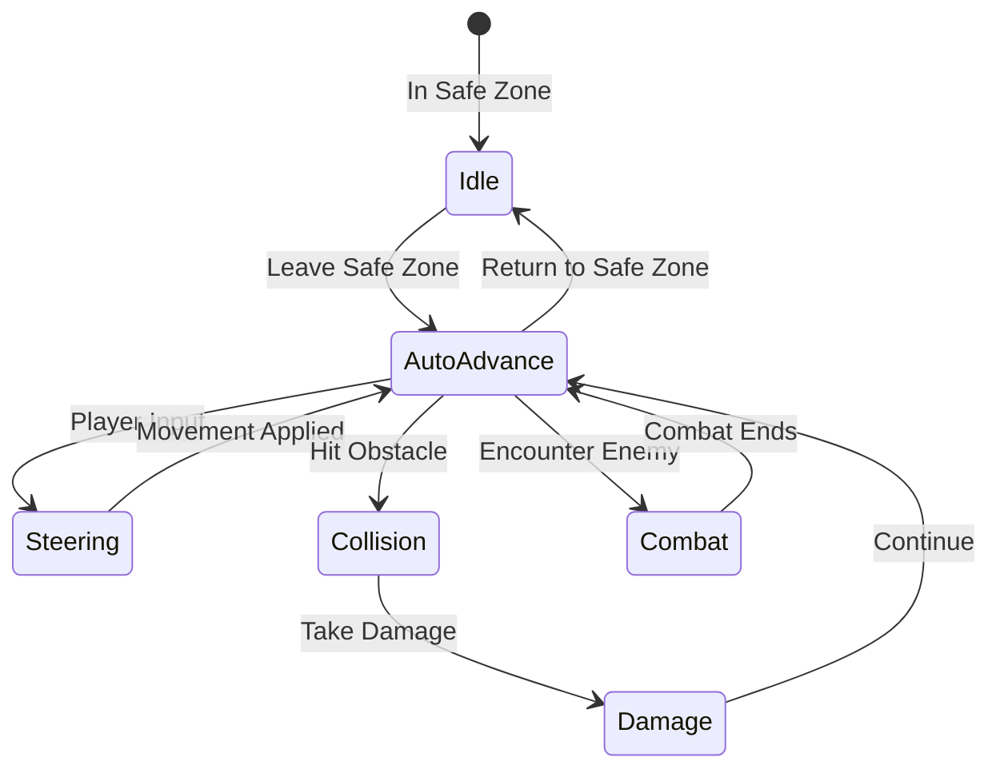
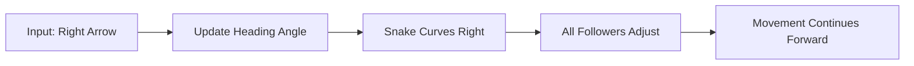
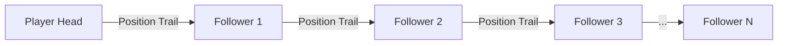
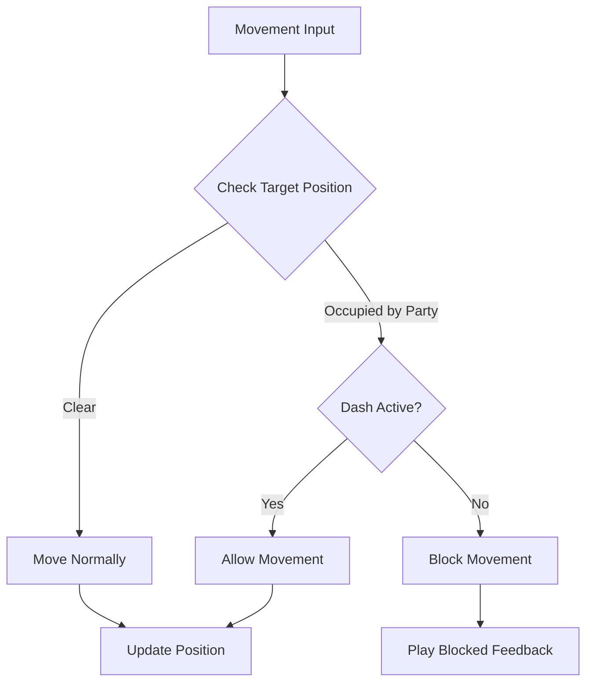

# Movement System Design

## Metadata
- **Type**: Game Design
- **Status**: Draft
- **Version**: 1.0
- **Last Updated**: 2026-02-08
- **Owner**: OCTP Team
- **Related Docs**: [gdd-core, movement-impl, party-system]

## Overview

The movement system combines snake-like chain formation with responsive real-time controls. The player directly controls the "head" (first party member) while follower party members automatically trail behind, creating a living chain that must navigate environments and position for combat.

## Goals

### Primary Goals
- Intuitive head control that feels responsive and precise
- Natural-feeling follower movement that maintains chain cohesion
- Strategic depth through formation and positioning
- Smooth performance with 10+ party members

### Secondary Goals
- Support both keyboard and gamepad input
- Allow for advanced movement techniques (whip turns, coiling)
- Visual clarity of chain positioning
- Collision that feels fair and predictable

## Dependencies

- **Core GDD** - Understanding overall game vision
- **Input System** - Unity's new Input System configured
- **Physics2D** - Unity's 2D physics for collision

## Constraints

### Technical Constraints
- Must maintain 60 FPS with 10 party members
- Maximum 10 party members in active chain
- 2D movement only (no z-axis)
- Must use Unity Input System (not legacy Input)

### Design Constraints
- Top-down perspective only
- Real-time continuous movement (not grid-based)
- Party members must maintain minimum spacing
- Chain cannot overlap itself (self-collision)

## Movement Mechanics

### Auto-Advance (Outside Safe Zones)

Outside safezones, the snake **continuously advances forward**. The player cannot stop this momentum, only **direct/aim** it.



**Key Properties**:
- **Default Speed**: X units/second (TBD via playtesting)
- **Direction**: 8-directional input (WASD, arrow keys, analog stick)
- **Steering**: Only affects direction, not speed
- **Cannot Stop**: Player cannot pause auto-advance
- **Active in Combat**: Snake continues forward even during combat encounters

### Head Control During Exploration

When auto-advancing, the player controls the **heading/direction** of the snake:



**Response Time**:
- Input latency: < 50ms
- Direction changes smoothly with lerp (factor: 0.2)
- Followers adjust trail automatically

### Head Control in Safe Zone

In safezones, the player has full **free movement**:
- WASD or analog stick for arbitrary direction movement
- No auto-advance; speed controlled by player (or zero for stationary menu access)

### Follower Movement (Party Chain)

Each party member follows the one ahead of them:



**Following Logic**:
1. Each follower stores a trail of positions from the unit ahead
2. Follower moves toward the trail position X frames behind
3. Distance maintained: 0.8 units between party members
4. Movement smoothed with interpolation (lerp factor: 0.15)

**Implementation Steps**:
1. **Create position trail** queue for each party member
   - Store positions every frame
   - Queue size: 60 positions (1 second at 60 FPS)
2. **Calculate target position** for each follower
   - Get position from leader's trail queue at index [spacing_frames]
   - spacing_frames = (desired_distance / leader_average_speed) * 60
3. **Move toward target** with smooth interpolation
   - Use Vector2.Lerp for smooth movement
   - Rotate sprite to face movement direction

### Formation Patterns

The chain naturally creates formations based on movement:

**Straight Line**:
```
  1 → 2 → 3 → 4
  (Moving right)
```

**Coiled**:
```
    4
  3 ← 2
      ↓
      1
  (Circling)
```

**Whip Turn**:
```
  4 → 3 → 2
          ↓
          1
  (Sharp corner)
```

These formations emerge naturally from movement without special modes.

## Advanced Mechanics

### Dash Mechanics
- **Duration**: 0.3 seconds
- **Speed Multiplier**: 2.4x base speed
- **Cooldown**: 2 seconds
- **Effects**:
  - Invulnerability during dash
  - Can pass through certain obstacles
  - Party chain "snaps" to new positions

### Self-Collision Prevention



**Rules**:
- Cannot move head through own party members
- Exception: During dash (can pass through)
- Collision feedback: Subtle shake/sound effect
- Followers never collide with each other (ghosting)

### Tight Space Navigation

Party must navigate through spaces smaller than full chain length:

**Challenge**: Corridor narrower than party length
```
█████████████
█→ 1→ 2 →3 █
█████████████
```

**Solution**: Party "compresses" temporarily
- Reduce spacing during tight navigation
- Return to normal spacing when space allows
- Visual: Tighter formation, faster follower movement

## Collision System

### Collision Types

#### Passable Obstacles / Hazards
**Definition**: Obstacles that do NOT block movement (grass, lava, water, etc.)

**Behavior**:
- Snake passes through without steering change
- May apply status effects or damage while intersecting
- Examples:
  - Tall Grass: Passable + Slow effect
  - Lava: Passable + Damage over time
  - Shallow Water: Passable + No effect (or slight slow)

**Character Stats**: All characters in the passable hazard suffer the effect; entire snake may be slowed

#### Impassable Obstacles
**Definition**: Obstacles that block movement (walls, rocks, cliffs, etc.)

**Behavior**:
1. Snake head auto-steers **minimum angle away** from collision
2. Does NOT stop; continues auto-advancing
3. Next frame, if still colliding, steers away again
4. Results in "sliding" along obstacle edge until bypassing it
5. Followers continue their path; may also collide and slide

**Example**: Circular rock at center of path
```
Snake heading North at circular obstacle:
  Frame 1: Hit obstacle → Redirect Northeast
  Frame 2: Hit again → Redirect North-Northeast  
  Frame 3: Hit again → Redirect North-North-Northeast
  Frame N: Fully past obstacle → Resume heading North
```

#### Snake vs Snake Collisions
**Definition**: Player snake overlapping with enemy snake (or itself)

**Behavior**:
- Treated as **Passable Obstacle** (not blocked)
- All **overlapping characters** get:
  - Speed reduced (affects whole snake's movement speed)
  - Defense reduced
- Non-overlapping characters unaffected
- Abilities (auto-attack, passive, active) still function if in range

**Combat Context**: No discrete "combat mode" — all interactions happen in continuous open world

#### Snake Self-Collision
**Definition**: Player snake overlapping its own tail

**Behavior**:
- Treated same as snake vs snake collision
- Overlapping character(s) get Speed/Defense penalty
- Can happen naturally through tight maneuvering or coiling
- Acts as a movement constraint (hard to maneuver when self-intersecting)

## Visual Feedback

### Movement Indicators
- **Head Direction**: Arrow or forward-facing sprite
- **Speed Lines**: Visual effect during fast movement
- **Dash Trail**: Particle effect during dash
- **Follower Sprites**: Face direction of movement

### Formation Visualization
- **Connection Lines**: Optional debug lines showing chain
- **Party Member Outlines**: Subtle glow indicating active party
- **Spacing Indicators**: During tight spaces, show compression

## Success Criteria

- [ ] Player can control head smoothly in 8 directions with < 100ms input lag
- [ ] Followers maintain 0.8 unit spacing during normal movement
- [ ] No jittering or erratic follower movement
- [ ] Self-collision prevention works 100% of the time
- [ ] Dash feels impactful and has clear visual feedback
- [ ] Can navigate through tight corridors without getting stuck
- [ ] Maintains 60 FPS with 10 party members moving
- [ ] Players understand movement within 30 seconds of tutorial

## Testing Strategy

### Unit Tests
- Position trail queue maintains correct size
- Follower spacing calculations are accurate
- Dash cooldown timer functions correctly
- Self-collision detection works reliably

### Integration Tests
- Head movement responds to input correctly
- Followers trail head accurately
- Physics collisions behave as expected
- Performance metrics under full party load

### Playtest Goals
- Movement feels responsive (player surveys)
- Chain behavior feels natural (video analysis)
- No unfair collision scenarios (bug reports)
- Advanced techniques are discoverable (observation)

## Open Questions

- **Q**: Should followers "cut corners" or follow exact path?
  - *Status*: Prototyping both; exact path feels better initially
- **Q**: What happens to follower positions during dash?
  - *Status*: Testing "snap to positions" vs "continue trailing"
- **Q**: Should there be a "precision mode" for tighter control?
  - *Status*: Will decide after initial playtesting
- **Q**: How does movement interact with abilities that root/slow?
  - *Status*: See Combat_System.md for status effects

## Technical Notes

### Performance Optimization
- Object pooling for position trail nodes
- Limit trail queue size based on party size
- Use FixedUpdate for physics, Update for input
- Cache component references in Awake()

### Edge Cases
- **Teleportation**: Reset follower trails to head position
- **Party Member Death**: Remove from chain, close gap
- **Party Member Added**: Insert into chain, create new trail
- **Dash into Wall**: Cancel dash, apply normal collision

## Changelog

- **v1.0** (2026-02-08): Initial movement system design

---

*See Movement_Implementation.md for technical specifications.*
