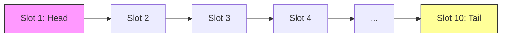
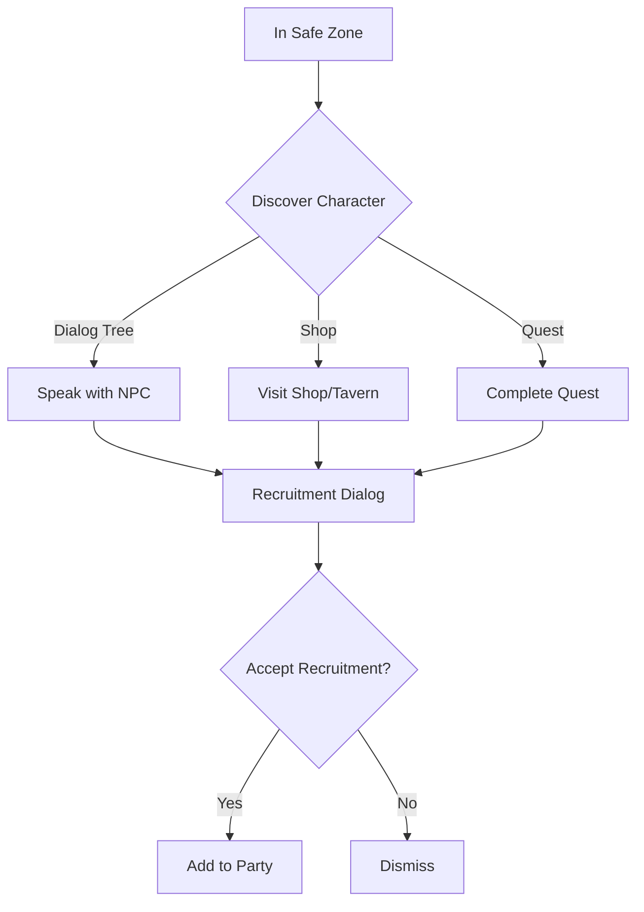
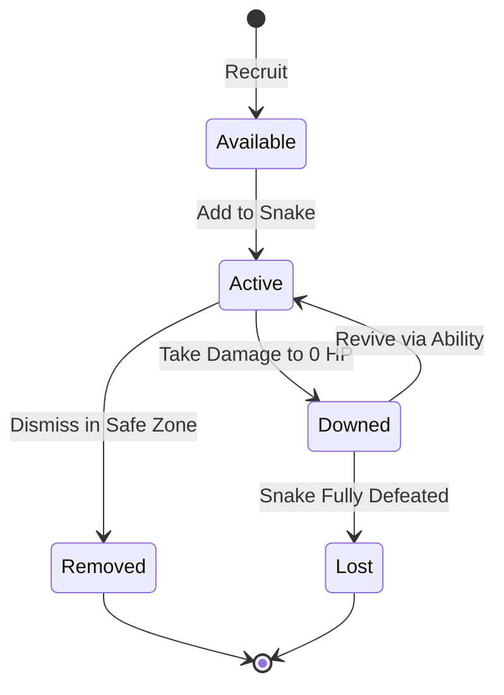

# Party System Design

## Metadata
- **Type**: Game Design
- **Status**: Draft
- **Version**: 1.0
- **Last Updated**: 2026-02-08
- **Owner**: OCTP Team
- **Related Docs**: [gdd-core, movement-system, combat-system, party-impl, progression-system]

## Overview

The party system manages the roster of characters that form the player's snake chain. Players recruit characters during runs, manage their positioning in the formation, and build synergistic teams. Party members can be lost during combat, creating meaningful risk/reward decisions around growth and composition.

## Goals

### Primary Goals
- Make each character feel distinct and valuable
- Create meaningful choices in party composition
- Balance risk of growth (longer chain) vs power
- Encourage experimentation with different builds

### Secondary Goals
- Clear visual identification of party members
- Intuitive party management UI
- Interesting synergies between characters
- Memorable character personalities/designs

## Dependencies

- **Core GDD** - Overall game structure
- **Movement System** - How party chain functions
- **Combat System** - How party members fight

## Constraints

### Technical Constraints
- Maximum 10 party members in active formation
- Each character requires: sprite, stats, 1-2 abilities
- Must support adding/removing members dynamically

### Design Constraints
- New player must understand basic system in single run
- No complex inventory management (keep it streamlined)
- Party composition changes during run, not between runs
- Limited ability slots per character (not a full RPG)

## Party Structure

### Active Party (The Snake Chain)



**Formation Rules**:
- Slot 1 (Head): Player-controlled character, "face" of the party
- Slots 2-10: Recruited party members, follow in chain
- Position matters: Different slots have strategic advantages
- Empty slots: Can be filled through recruitment

**Position Bonuses**:
- **Head (Slot 1)**: Higher movement speed, first to engage
- **Middle (Slots 2-7)**: Balanced position, safe from most attacks
- **Tail (Slots 8-10)**: Bonus to defensive abilities, vulnerable to rear attacks

### Reserve Party (Future Expansion)

For post-MVP: Characters not in active chain but available for swapping.

## Character Stats & Progression

### Primary Stats
Characters improve through leveling with **weighted randomness**:
- **Strength**: Physical damage output, melee effectiveness
- **Skill**: Ranged accuracy and damage, dodge mechanics
- **Toughness**: Maximum health and physical defense
- **Speed**: Attack rate and snake movement speed
- **Will**: Magic resistance and protective ability power
- **Aura**: Magical damage and ability effectiveness
- **Luck**: Affects all calculations subtly (very small scale)

**Leveling**:
- Entire party levels together when entering a safe zone
- Collected XP distributed evenly among permanent members (NPCs excluded)
- Logarithmic scaling: early gains are meaningful, later levels take exponentially more XP
- Effective maximum exists but no hard cap

### Secondary Stats
Derived from primary stats, class bonuses, equipment, and passive abilities:
- Health Pool (from Toughness + class bonuses)
- Physical Armor (from Toughness + equipment)
- Magical Armor (from Will + equipment)
- Critical Chance (from Skill + equipment)
- etc.

### Equipment
Characters equip up to 3 item slots for customization:
- **Weapon**: Affects attack range, base damage, attack type
- **Armor**: Affects defense, max HP, sometimes grants passive effects
- **Accessory**: Stat bonuses, active effects, passive effects

**Acquisition**:
- Purchased in safe zone shops
- Looted from enemies/chests during exploration
- Quest rewards
- Crafted via crafting system

## Recruitment System

### Discovery

Characters are found and recruited in **safe zones**:



**Special Case: Rescue Missions**
In some exploration areas, NPCs can be rescued mid-adventure:
- Moving over an NPC with the snake automatically recruits them
- Rescued NPC is significantly weaker (intentionally)
- Can be more powerful after returning to safe zone
- Creates tactical decision: risk exploration depth for reward of recruiting stronger ally

### Recruitment Choices

When offered recruitment:
1. View character name, class, level, and abilities
2. See current party composition
3. Decide: Accept or Decline
4. If accepted and party has space: Add immediately
5. If party full (10/10): Choose existing member to replace **or** leave snake and recruit new member

**Decision Factors**:
- Does this class fill a tactical gap? (missing healer, ranged, etc.)
- Do their abilities synergize with current party?
- Is party already strong enough, or do we need more firepower?
- Is the new character weak or strong?

### Party Composition

**Maximum Size**: 10 characters in active snake
**Minimum Size**: 1 character (just the player/head)

**Composition Mechanics**:
- Cannot remove all characters (always need at least one)
- Can voluntarily dismiss characters to reduce snake length
- No limit on character class duplicates (can have two Warriors)
- New recruits start at a base level, gain XP with rest of party

## Party Management

### Reordering Formation

```
Current:  [Head] → [Warrior] → [Ranger] → [Healer]
Reorder:  [Head] → [Healer] → [Warrior] → [Ranger]
```

**When**: Between combats, at safe areas
**How**: Drag-and-drop UI showing chain formation
**Why**: Optimize positioning for upcoming challenges

### Removing Members

**Voluntary**: 
- Dismiss party members to reduce chain length
- Dismissed members are lost (no reserve)

**Involuntary**:
- Party member reaches 0 HP: Lost from chain
- Gap in formation closes automatically
- Lost members cannot be recovered in that run

### Upgrading Members

**Level Up**:
- Characters gain XP from combat
- Level up: Improve stats slightly
- Every 2 levels: Choose one ability upgrade

**Equipment** (Post-MVP):
- Find/buy equipment during run
- Assign to specific party members
- Passive stat bonuses or active effects

## Synergy System

### Ability Combos

Example synergies:
```
Warrior's Shield Bash (stun) 
  + Ranger's Piercing Shot 
  = Bonus damage on stunned enemies

Healer's Protective Barrier
  + Warrior's Fortify
  = Extended duration, more defense
```

**Discovery**: Players discover combos through experimentation

### Formation Synergies

Certain class combinations work better together:

**Frontline Tank** (Warrior at head)
- Benefits: Absorbs damage, protects squishier members
- Pairs well with: Ranged DPS behind them

**Balanced Mix** (Tank, DPS, Support)
- Benefits: Adaptable to various situations
- Trade-off: No particular strength

**Glass Cannon** (All DPS, no tanks)
- Benefits: High damage output
- Risk: Very vulnerable, requires skill

## Party Member States



### State Definitions

- **Available**: Recruited but in reserve (can be recruited in safe zone via shop/dialog)
- **Active**: Currently in formation, fighting
- **Downed**: At 0 HP, cannot attack/activate abilities, speed reduced
- **Lost**: Combat ended with all snake members downed; run ends if can't reach safe zone
- **Removed**: Voluntarily dismissed from party in safe zone

### Downed Mechanics

When a character reaches 0 HP:
1. Character cannot attack or activate abilities
2. Snake speed reduced significantly (TBD: -30%? -50%?)
3. Some passive abilities may reduce this penalty
4. Some active abilities may revive downed members
5. If all characters in snake are downed, snake is defeated

**Recovery**:
- Healing only works on non-downed allies (cannot heal back to 0 HP)
- Resurrection abilities can revive downed characters mid-combat
- Healing orbs collected during exploration activate immediately when picked up (if alliance party is damaged)

## UI/UX Design

### Party Display (HUD)

```
┌─────────────────────────────────────┐
│ [HP: ████████░░] Warrior   Lv3     │
│ [HP: ██████░░░░] Ranger    Lv2     │
│ [HP: ███████░░░] Healer    Lv2     │
└─────────────────────────────────────┘
```

**Information Shown**:
- Character icon/portrait
- Current HP bar
- Class name
- Level
- Status effects (icons)

**Position**: Left side of screen, vertical list

### Recruitment UI

```
┌─────────────────────────────────┐
│   A new ally offers to join!    │
│                                  │
│   [Character Portrait]           │
│   Ranger - Level 1               │
│   "I can help from range!"       │
│                                  │
│   Abilities:                     │
│   • Piercing Shot               │
│   • Snare Trap                  │
│                                  │
│   Current Party: 7/10           │
│                                  │
│   [Accept]      [Decline]       │
└─────────────────────────────────┘
```

### Formation Management UI

Visual drag-and-drop showing current snake order with ability to reorder.

## Success Criteria

- [ ] Players understand party composition matters within 2 runs
- [ ] At least 3 viable party compositions for different playstyles
- [ ] Recruiting new character feels exciting and impactful
- [ ] Losing a party member feels meaningful but not run-ending
- [ ] Party management UI is clear and doesn't interrupt flow
- [ ] 80% of playtesters experiment with different compositions
- [ ] Formation positioning creates clear strategic choices

## Balancing Guidelines

### Party Size vs Difficulty
- 1-3 members: Early game power level
- 4-6 members: Mid-game sweet spot
- 7-10 members: High power, high complexity

### Character Power Levels
- All classes viable in different roles
- No single "must-have" character
- Trade-offs between classes are clear

### Loss Mitigation
- Losing one member shouldn't end run
- Losing 50%+ of party is major setback
- Revival mechanics possible in safe areas (cost resource)

## Open Questions

- **Q**: Should party members have permanent death across all runs, or just current run?
  - *Status*: Leaning toward current run only for MVP
- **Q**: How many duplicate classes can you have? (e.g., two Warriors)
  - *Status*: Allow duplicates for simplicity
- **Q**: Should there be a party-wide resource (mana/energy) or per-character?
  - *Status*: Per-character cooldowns, no shared resource
- **Q**: Can you revive downed party members during combat or only after?
  - *Status*: Only after combat for MVP, in-combat revival could be ability later

## Technical Notes

### Data Structure
```csharp
// Simplified structure
public class PartyMember {
    string characterId;
    int level;
    int currentHP;
    int maxHP;
    List<Ability> abilities;
    Vector2 positionInChain;
}

public class PartyManager {
    List<PartyMember> activeParty;  // Max 10
    PartyMember head;               // Player character
}
```

See: [Party_Implementation.md](../02-TechnicalDesign/Party_Implementation.md)

## Changelog

- **v1.0** (2026-02-08): Initial party system design

---

*This system creates strategic depth through composition, positioning, and risk management.*
