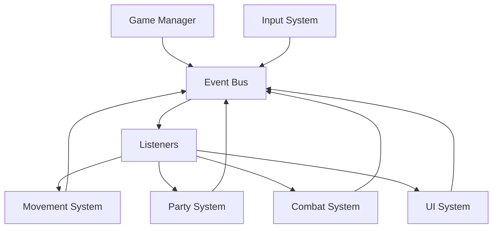
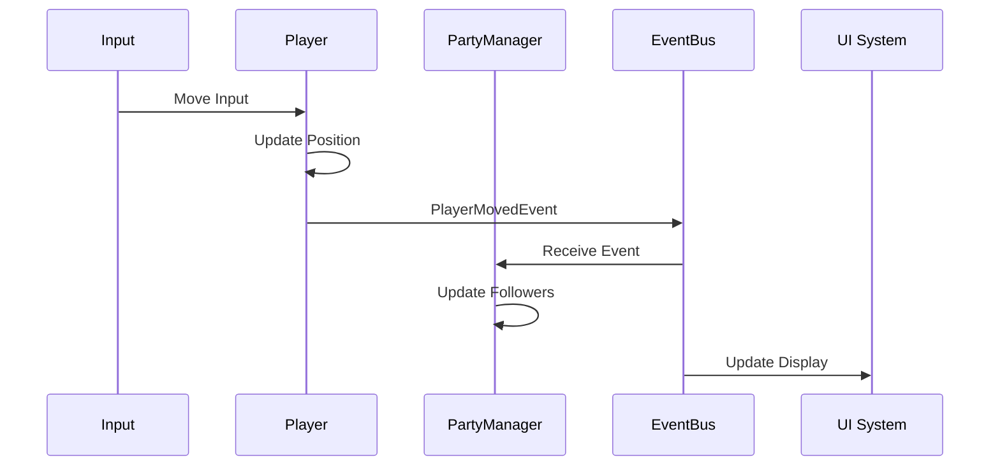

# Technical Architecture

## Metadata
- **Type**: Technical Design
- **Status**: Draft
- **Version**: 1.0
- **Last Updated**: 2026-02-08
- **Owner**: OCTP Team
- **Related Docs**: [gdd-core, movement-impl, party-impl, combat-impl]

## Overview

This document defines the overall technical architecture for OCTP, including code organization, design patterns, data flow, and system interactions. The architecture follows Unity best practices with assembly definitions, ScriptableObject-based configuration, and modular system design.

## Goals

- Maintainable codebase with clear separation of concerns
- Performant at 60 FPS with 10+ party members and 15+ enemies
- Modular systems that can be developed and tested independently
- Extensible design supporting future content additions

## Architecture Patterns

### Core Architectural Style

**Event-Driven Architecture** with **Component-Based Design**



Benefits:
- Loose coupling between systems
- Easy to add new features
- Clear data flow
- Testable in isolation

### Design Patterns Used

1. **Singleton** - Managers (GameManager, InputManager, etc.)
2. **Observer** - Event system for inter-system communication
3. **Command** - Input handling and ability execution
4. **Object Pool** - Projectiles, effects, enemies
5. **State Machine** - Character states, game states
6. **Factory** - Character and enemy spawning
7. **Strategy** - AI behaviors, ability implementations

## System Architecture

### High-Level Systems

```
OCTP/
├── Core/               # Shared utilities and managers
│   ├── GameManager
│   ├── EventBus
│   ├── ServiceLocator
│   └── Utilities
├── Player/             # Player-specific code
│   ├── PlayerController
│   ├── PlayerInput
│   └── PlayerState
├── Party/              # Party management
│   ├── PartyManager
│   ├── PartyMember
│   └── Formation
├── Combat/             # Combat systems
│   ├── CombatManager
│   ├── Abilities
│   ├── Damage
│   └── StatusEffects
├── Enemies/            # Enemy AI and behaviors
│   ├── EnemyAI
│   ├── EnemyTypes
│   └── Spawning
├── UI/                 # User interface
│   ├── HUD
│   ├── Menus
│   └── PartyDisplay
└── Systems/            # Game systems
    ├── Progression
    ├── SaveLoad
    └── Audio
```

### Assembly Definitions

**Separation by Feature**:
- `OCTP.Core` - No dependencies
- `OCTP.Player` - Depends on Core, Input System
- `OCTP.Party` - Depends on Core
- `OCTP.Combat` - Depends on Core
- `OCTP.Enemies` - Depends on Core
- `OCTP.UI` - Depends on Core
- `OCTP.Editor` - Editor-only tools
- `OCTP.Tests.*` - Test assemblies

Benefits:
- Faster compilation (only changed assemblies recompile)
- Clear dependency graph
- Prevents circular dependencies

## Core Systems

### 1. Game Manager (Core)

**Responsibility**: Overall game state and initialization

```csharp
namespace OCTP.Core
{
    public class GameManager : MonoBehaviour
    {
        private static GameManager _instance;
        public static GameManager Instance => _instance;
        
        [SerializeField] private GameState _currentState;
        
        void Awake()
        {
            // Singleton setup
            // Initialize services
            // Load persistent data
        }
        
        public void ChangeState(GameState newState) { }
    }
    
    public enum GameState
    {
        MainMenu,
        InRun,
        Paused,
        GameOver
    }
}
```

### 2. Event Bus (Core)

**Responsibility**: Decoupled communication between systems

```csharp
namespace OCTP.Core
{
    public class EventBus : MonoBehaviour
    {
        private static EventBus _instance;
        private Dictionary<Type, List<Delegate>> _eventHandlers;
        
        public static void Subscribe<T>(Action<T> handler) where T : IGameEvent { }
        public static void Unsubscribe<T>(Action<T> handler) where T : IGameEvent { }
        public static void Publish<T>(T gameEvent) where T : IGameEvent { }
    }
    
    // Event examples
    public interface IGameEvent { }
    public struct PlayerMovedEvent : IGameEvent
    {
        public Vector2 NewPosition;
    }
    public struct PartyMemberAddedEvent : IGameEvent
    {
        public PartyMember Member;
    }
}
```

### 3. Service Locator (Core)

**Responsibility**: Provide access to shared services

```csharp
namespace OCTP.Core
{
    public static class ServiceLocator
    {
        private static Dictionary<Type, object> _services = new();
        
        public static void Register<T>(T service) { }
        public static T Get<T>() { }
        public static bool TryGet<T>(out T service) { }
    }
}
```

Usage:
```csharp
// Register
ServiceLocator.Register<IInputService>(new InputService());

// Access
var input = ServiceLocator.Get<IInputService>();
```

## Data Architecture

### ScriptableObject Configuration

Use ScriptableObjects for game data:

```csharp
namespace OCTP.Party
{
    [CreateAssetMenu(fileName = "CharacterData", menuName = "OCTP/Character")]
    public class CharacterData : ScriptableObject
    {
        public string CharacterName;
        public CharacterClass Class;
        public int BaseHealth;
        public int BaseDamage;
        public float MoveSpeed;
        public List<AbilityData> Abilities;
        public Sprite CharacterSprite;
    }
}
```

**Benefits**:
- Designer-friendly
- Hot-reloadable in editor
- Easy to balance and iterate
- Centralized data management

### Data Flow Pattern



**Key Principles**:
- Systems don't directly reference each other
- Communication through events or interfaces
- Data flows one direction where possible
- State changes trigger events

## Performance Optimization

### Object Pooling Strategy

```csharp
namespace OCTP.Core
{
    public class ObjectPool<T> where T : MonoBehaviour
    {
        private Queue<T> _pool;
        private T _prefab;
        private Transform _parent;
        
        public T Get() { }
        public void Return(T obj) { }
    }
}
```

**Pool These**:
- Projectiles (arrows, spells)
- Visual effects (particles, damage numbers)
- Enemies (reuse instances)
- UI elements (damage popups)

### Update Loop Optimization

```csharp
// Instead of multiple Update() calls
public class UpdateManager : MonoBehaviour
{
    private List<IUpdatable> _updatables = new();
    
    void Update()
    {
        // Single Update loop for all registered objects
        for (int i = 0; i < _updatables.Count; i++)
        {
            _updatables[i].OnUpdate(Time.deltaTime);
        }
    }
}

public interface IUpdatable
{
    void OnUpdate(float deltaTime);
}
```

### Memory Management

- Cache component references in Awake()
- Use struct for small data types
- Avoid LINQ in hot paths (use for loops)
- Pool frequently allocated objects
- Use object references, not FindObjectOfType()

## Dependency Injection

### Constructor Injection Pattern

```csharp
namespace OCTP.Player
{
    public class PlayerController : MonoBehaviour
    {
        private IInputService _input;
        private IMovementService _movement;
        
        public void Initialize(IInputService input, IMovementService movement)
        {
            _input = input;
            _movement = movement;
        }
    }
}
```

**Benefits**:
- Testable (can inject mocks)
- Clear dependencies
- Flexible implementation swapping

## Testing Strategy

### Test Structure

```
Tests/
├── EditMode/
│   ├── PartyManagerTests.cs
│   ├── MovementSystemTests.cs
│   └── UtilityTests.cs
└── PlayMode/
    ├── CombatIntegrationTests.cs
    ├── InputTests.cs
    └── PerformanceTests.cs
```

### Testing Patterns

**Unit Tests** (EditMode):
```csharp
[Test]
public void PartyManager_AddMember_IncreasesCount()
{
    var manager = new PartyManager();
    var member = CreateTestMember();
    
    manager.AddMember(member);
    
    Assert.AreEqual(1, manager.MemberCount);
}
```

**Integration Tests** (PlayMode):
```csharp
[UnityTest]
public IEnumerator Movement_WithInput_UpdatesPosition()
{
    var player = CreateTestPlayer();
    var input = new Vector2(1, 0);
    
    player.ApplyInput(input);
    yield return new WaitForSeconds(0.1f);
    
    Assert.Greater(player.transform.position.x, 0);
}
```

## Debugging and Logging

### Logging System

```csharp
namespace OCTP.Core
{
    public static class GameLogger
    {
        public static void Log(string message, LogCategory category = LogCategory.General) { }
        public static void LogWarning(string message, LogCategory category = LogCategory.General) { }
        public static void LogError(string message, LogCategory category = LogCategory.General) { }
    }
    
    public enum LogCategory
    {
        General,
        Movement,
        Combat,
        Party,
        Performance
    }
}
```

### Debug Visualization

- Gizmos for movement paths
- Debug lines for party chain
- On-screen performance stats
- Event log for debugging flow

## Technical Constraints

- **Unity Version**: 6000.3.7f1
- **Render Pipeline**: URP 2D
- **Target Frame Rate**: 60 FPS
- **Platform**: PC (Windows/Mac/Linux)
- **Input**: Keyboard/Mouse (Gamepad future)
- **Max Party Size**: 10 members
- **Max Enemies On Screen**: 30

## Success Criteria

- [ ] Maintains 60 FPS with 10 party + 15 enemies
- [ ] No circular dependencies between assemblies
- [ ] All core systems unit tested (>70% coverage)
- [ ] < 100ms input lag from input to visual response
- [ ] Clean separation: Core, Player, Party, Combat assemblies
- [ ] Event-driven communication working reliably
- [ ] Object pools preventing garbage collection spikes
- [ ] Save/load system working without data loss

## Open Questions

- **Q**: Should we use ECS (Unity DOTS) for performance?
  - *Status*: No for MVP; traditional MonoBehaviour sufficient
- **Q**: How to handle scene loading and persistence?
  - *Status*: Single persistent scene + additive scene loading
- **Q**: Use Addressables or Resources for runtime loading?
  - *Status*: Resources for MVP, Addressables if needed later

## Changelog

- **v1.0** (2026-02-08): Initial architecture document

---

*This architecture supports the game design goals while maintaining code quality and performance.*
