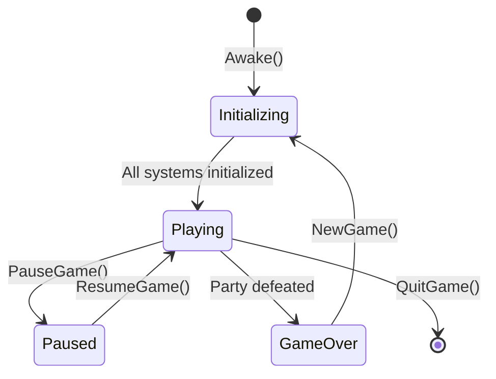

# Game Manager Specification

## Metadata
- **Type**: Technical Design
- **Status**: Draft
- **Version**: 1.0
- **Last Updated**: 2026-02-08
- **Owner**: OCTP Team
- **Related Docs**: [architecture-overview, state-management-spec]

## Overview

The Game Manager is the central orchestrator for core systems. It handles initialization, lifecycle management (Play/Pause/Resume/Quit), and provides service locator access to all core managers.

## Goals

- **Centralized Initialization**: Boot all core systems in correct order
- **Lifecycle Management**: Control game play state and shutdown
- **Service Locator**: Easy access to managers from anywhere
- **Cross-System Coordination**: Mediate communication between systems
- **Dependency Injection**: Support testable architecture with mocks

## Implementation

```csharp
public class GameManager : MonoBehaviour, IGameService
{
    private static GameManager _instance;
    public static GameManager Instance => _instance;
    
    public event Action OnGameStarted;
    public event Action OnGamePaused;
    public event Action OnGameResumed;
    public event Action OnGameEnded;
    
    private bool _isInitialized = false;
    private Dictionary<System.Type, object> _services = new();
    
    private void Awake()
    {
        if (_instance != null && _instance != this)
        {
            Destroy(gameObject);
            return;
        }
        
        _instance = this;
        DontDestroyOnLoad(gameObject);
        
        InitializeAllSystems();
    }
    
    private void InitializeAllSystems()
    {
        try
        {
            Debug.Log("=== OCTP GameManager Initialization ===");
            
            // 1. Create core managers in order
            var stateManager = gameObject.AddComponent<GameStateManager>();
            var saveManager = gameObject.AddComponent<SaveManager>();
            var cloudSyncManager = gameObject.AddComponent<CloudSyncManager>();
            var inputManager = gameObject.AddComponent<InputManager>();
            var sceneLoader = gameObject.AddComponent<SceneLoader>();
            var partyManager = gameObject.AddComponent<PartyManager>();
            var configManager = gameObject.AddComponent<ConfigManager>();
            
            // 2. Register interfaces in service locator (NOT concrete types)
            RegisterService<IGameStateManager>(stateManager);
            RegisterService<ISaveManager>(saveManager);
            RegisterService<ICloudSyncManager>(cloudSyncManager);
            RegisterService<IInputManager>(inputManager);
            RegisterService<ISceneLoader>(sceneLoader);
            RegisterService<IPartyManager>(partyManager);
            RegisterService<IConfigManager>(configManager);
            
            // 3. Hook up event listeners
            stateManager.OnStateChanged += OnGameStateChanged;
            saveManager.OnGameSaved += OnGameSaved;
            saveManager.OnGameLoaded += OnGameLoaded;
            
            // 4. Load game or start new game
            if (saveManager.TryLoad(out var saveData))
            {
                OnGameLoaded(saveData);
                sceneLoader.LoadZoneAsync(saveData.Progress.CurrentZone);
            }
            else
            {
                OnNewGameStart();
            }
            
            _isInitialized = true;
            OnGameStarted?.Invoke();
            Debug.Log("GameManager initialization complete");
        }
        catch (System.Exception ex)
        {
            Debug.LogError($"GameManager initialization failed: {ex}");
            throw;
        }
    }
    
    public void RegisterService<T>(object implementation) where T : class
    {
        _services[typeof(T)] = implementation;
        Debug.Log($"Registered service: {typeof(T).Name}");
    }
    
    public T GetService<T>() where T : class
    {
        if (_services.TryGetValue(typeof(T), out var service))
            return (T)service;
        
        throw new System.InvalidOperationException(
            $"Service {typeof(T).Name} not registered");
    }
    
    public void PauseGame()
    {
        var stateManager = GetService<IGameStateManager>();
        if (stateManager.CurrentState == GameState.Paused)
            return;
        
        stateManager.TrySetState(GameState.Paused);
        Time.timeScale = 0f;
        OnGamePaused?.Invoke();
    }
    
    public void ResumeGame()
    {
        var stateManager = GetService<IGameStateManager>();
        if (stateManager.CurrentState != GameState.Paused)
            return;
        
        Time.timeScale = 1f;
        stateManager.TrySetState(GameState.Exploration);
        OnGameResumed?.Invoke();
    }
    
    public void QuitGame()
    {
        Debug.Log("Quitting game");
        OnGameEnded?.Invoke();
        
        #if UNITY_EDITOR
            UnityEditor.EditorApplication.isPlaying = false;
        #else
            Application.Quit();
        #endif
    }
    
    public void NewGame()
    {
        Debug.Log("Starting new game");
        var partyManager = GetService<IPartyManager>();
        partyManager.InitializeNewParty();
        
        var stateManager = GetService<IGameStateManager>();
        stateManager.ForceSetState(GameState.Exploration);
        
        GetService<ISceneLoader>().LoadZoneAsync("Zone_SafeZone");
    }
    
    private void OnNewGameStart()
    {
        var partyManager = GetService<IPartyManager>();
        partyManager.InitializeNewParty();
    }
    
    private void OnGameStateChanged(GameState oldState, GameState newState)
    {
        Debug.Log($"GameState: {oldState} → {newState}");
    }
    
    private void OnGameSaved(SaveData saveData)
    {
        Debug.Log($"Game saved at {saveData.SaveTime}");
    }
    
    private void OnGameLoaded(SaveData saveData)
    {
        Debug.Log($"Game loaded (Level {saveData.Progress.CurrentLevel})");
        var partyManager = GetService<IPartyManager>();
        partyManager.LoadPartyFromSave(saveData);
    }
}
```

## IGameService Interface

```csharp
public interface IGameService
{
    // Marker interface for services
    // Enables type-safe service registration
}
```

## ServiceLocator Pattern (Interface-Based)

```csharp
public static class ServiceLocator
{
    private static Dictionary<System.Type, object> _services = new();
    
    // Register interface implementations only (never concrete types)
    public static void Register<T>(object implementation) where T : class
    {
        if (implementation == null)
            throw new System.ArgumentNullException(nameof(implementation));
        
        _services[typeof(T)] = implementation;
        Debug.Log($"Registered service: {typeof(T).Name}");
    }
    
    // Get by interface type only
    public static T Get<T>() where T : class
    {
        if (_services.TryGetValue(typeof(T), out var service))
            return (T)service;
        
        throw new KeyNotFoundException(
            $"Service {typeof(T).Name} not registered");
    }
}

// CORRECT USAGE - Register/Get by interface, not concrete type
ServiceLocator.Register<ISaveManager>(new SaveManager());
ServiceLocator.Register<IGameStateManager>(new GameStateManager());

var saveManager = ServiceLocator.Get<ISaveManager>();  // ✅ Correct
var stateManager = ServiceLocator.Get<IGameStateManager>();  // ✅ Correct

// WRONG - Never do this
// ServiceLocator.Register<SaveManager>(saveManager);  // ❌ Wrong
// var sm = ServiceLocator.Get<SaveManager>();  // ❌ Wrong
```

### Why Interface-Based Service Locator?

**Testability**: Mock interfaces in unit tests without needing concrete implementations

```csharp
[Test]
public void TestGameLogic()
{
    // Create mock implementations
    var mockSaveManager = new MockSaveManager();
    var mockInputManager = new MockInputManager();
    
    // Register mocks by interface
    ServiceLocator.Register<ISaveManager>(mockSaveManager);
    ServiceLocator.Register<IInputManager>(mockInputManager);
    
    // Now test with mocks instead of real implementations
    var gameLogic = new GameLogic();
    gameLogic.SomeMethod();
    
    Assert.IsTrue(mockSaveManager.SaveWasCalled);
}
```

**Loose Coupling**: Implementation can change without affecting code using the interface

```csharp
// Implement interface multiple ways
public class SaveManager : ISaveManager { }
public class MockSaveManager : ISaveManager { }
public class DummySaveManager : ISaveManager { }

// Code using ISaveManager works with all implementations
var saveManager = ServiceLocator.Get<ISaveManager>();  // Works with any!
```

**Dependency Injection Ready**: Easy to inject dependencies at runtime

```csharp
public class CombatSystem
{
    private ISaveManager _saveManager;
    private IPartyManager _partyManager;
    
    public CombatSystem()
    {
        // Get dependencies from service locator
        _saveManager = ServiceLocator.Get<ISaveManager>();
        _partyManager = ServiceLocator.Get<IPartyManager>();
    }
}
```


## Initialization Order

```
1. GameManager.Awake()
   ↓
2. Create All Core Managers
   ├─ GameStateManager
   ├─ SaveManager
   ├─ CloudSyncManager
   ├─ InputManager
   ├─ SceneLoader
   ├─ PartyManager
   └─ ConfigManager
   ↓
3. Register in ServiceLocator
   ↓
4. Hook Event Listeners
   ↓
5. Load or New Game
   ├─ Try Load: SaveManager.TryLoad()
   └─ Create New: PartyManager.InitializeNewParty()
   ↓
6. Load First Scene
   ↓
7. Set Initial State → Exploration or MainMenu
   ↓
8. Fire OnGameStarted Event
```

## Lifecycle Diagram



## Success Criteria

- [x] All core systems initialize in correct order
- [x] Services accessible via ServiceLocator
- [x] Game can be paused/resumed
- [x] New game properly initializes party
- [x] Save game properly restores state
- [x] Quit game cleans up resources

## Testing

```csharp
[Test]
public void TestGameManagerSingleton()
{
    var gm1 = GameManager.Instance;
    var gm2 = GameManager.Instance;
    Assert.AreEqual(gm1, gm2);
}

[Test]
public void TestServiceLocator()
{
    var saveManager = ServiceLocator.Get<SaveManager>();
    Assert.IsNotNull(saveManager);
}

[Test]
public void TestPauseResume()
{
    GameManager.Instance.PauseGame();
    Assert.AreEqual(GameState.Paused, 
        ServiceLocator.Get<GameStateManager>().CurrentState);
    
    GameManager.Instance.ResumeGame();
    Assert.AreEqual(GameState.Exploration,
        ServiceLocator.Get<GameStateManager>().CurrentState);
}

[Test]
public void TestNewGame()
{
    GameManager.Instance.NewGame();
    var party = ServiceLocator.Get<PartyManager>().GetParty();
    Assert.Greater(party.Members.Count, 0);
}
```

## Changelog

- v1.0 (2026-02-08): Initial game manager specification

