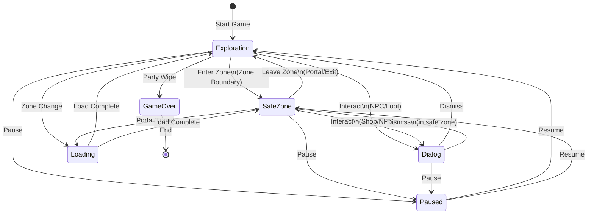

# State Management Specification

## Metadata
- **Type**: Technical Design
- **Status**: Draft
- **Version**: 1.1
- **Last Updated**: 2026-02-08
- **Owner**: OCTP Team
- **Related Docs**: [architecture-overview, gdd-core, scene-management-spec, input-system-spec]

## Overview

The State Management System tracks and manages game state (Exploration, SafeZone, Dialog, Paused, Loading, GameOver) and controls valid transitions between states. It acts as a hub for cross-system communication, enabling input managers, scene loaders, and UI controllers to react to state changes appropriately.

## Goals

- **Clear Game Flow**: Define all valid states and transitions
- **Single Source of Truth**: GameStateManager is authoritative on current game state
- **Event-Driven Reactions**: Systems subscribe to state changes, not poll
- **Prevent Invalid States**: Finite state machine validates all transitions
- **Enable Context Sensitivity**: InputManager and UI respond based on state
- **Testable State Logic**: State transitions can be unit tested in isolation

## Dependencies

- **Architecture Overview** - System design foundation
- **Core GDD** - Game states defined in game design
- **Input System Spec** - InputManager reacts to state changes
- **Scene Management Spec** - SceneLoader triggered by state changes

## Constraints

- **No State Cross-Talk**: States cannot directly transition; only StateManager can change state
- **Atomic Transitions**: State change must be complete before listeners react
- **No Recursive Calls**: Listeners cannot trigger state changes from their handlers
- **Performance**: State checks must be < 0.1ms (instant)

## State Machine Design

### Game States

The state machine now includes **9 states** (6 main + 3 intermediate) with slide animations (1s) between transitions:

```csharp
public enum GameState
{
    // Main gameplay states
    Exploration,           // Roaming zones, in combat
    SafeZone,              // In settlement, menus available
    Dialog,                // NPC dialog, shop, or other interaction
    Paused,                // Game paused, only resume/settings
    Loading,               // Transitioning between scenes
    GameOver,              // All party members defeated
    
    // Intermediate animation states (added for smooth transitions)
    DialogClosing,         // Dialog fading out before dismissal (0.5s animation)
    SafeZoneClosing,       // Safe zone closing before exploration (0.5s animation)
    TransitionLoading      // Loading screen with fade/slide effect (1s animation)
}
```

**Animation Timing**: All state transitions trigger 1s slide animations:
- Exit animation (500ms): Current state slides out
- Entry animation (500ms): New state slides in
- State change happens atomically at 500ms mark

### Valid Transitions

```
Exploration → SafeZone         (Player enters zone boundary)
Exploration → Dialog           (NPC interaction, pick up item)
Exploration → Paused           (Press ESC / pause button)
Exploration → Loading          (Scene transition to new zone)
Exploration → GameOver         (All members downed)

SafeZone → Exploration         (Player leaves zone, goes to portal)
SafeZone → SafeZoneClosing     (0.5s intermediate state for animation)
SafeZoneClosing → Exploration  (After animation completes)
SafeZone → Dialog              (NPC interaction, shop, inn, etc.)
SafeZone → Paused              (Press ESC / pause button)
SafeZone → Loading             (Scene transition to new zone)

Dialog → DialogClosing         (0.5s intermediate state for animation)
DialogClosing → Exploration    (If dismissed in exploration)
DialogClosing → SafeZone       (If dismissed in safe zone)
Dialog → Paused                (Press ESC / pause button - no closing state)

Paused → Exploration           (Resume from exploration)
Paused → SafeZone              (Resume from safe zone)
Paused → Paused                (Blocked - single pause level only)

Loading → TransitionLoading    (Scene loading with fade/slide)
TransitionLoading → Exploration (New zone loaded)
TransitionLoading → SafeZone   (New safe zone loaded)

GameOver → Exploration         (Respawn in safe zone - resets on load)
Any State → Loading            (Emergency scene transition)
```

### Blocked Transitions

```
SafeZone → SafeZone          (Invalid - already in safe zone)
Dialog → Dialog              (Invalid - must dismiss first)
Exploration → Exploration    (Invalid - already exploring)
Loading → Loading            (Invalid - already loading)
Paused → Paused              (Invalid - already paused)
```

### Transition Diagram



## Implementation

### GameStateManager Class

```csharp
public class GameStateManager : MonoBehaviour, IGameService
{
    private static GameStateManager _instance;
    public static GameStateManager Instance => _instance;
    
    private GameState _currentState = GameState.Exploration;
    private GameState _previousState = GameState.Exploration;
    
    // Event for state changes: (oldState, newState)
    public event Action<GameState, GameState> OnStateChanged;
    
    // State-specific events
    public event Action OnEnteringExploration;
    public event Action OnLeavingExploration;
    public event Action OnEnteringSafeZone;
    public event Action OnLeavingSafeZone;
    public event Action OnEnteringDialog;
    public event Action OnLeavingDialog;
    public event Action OnPaused;
    public event Action OnResumed;
    public event Action OnLoadingStarted;
    public event Action OnLoadingComplete;
    public event Action OnGameOver;
    
    // Property for read-only access
    public GameState CurrentState => _currentState;
    public GameState PreviousState => _previousState;
    
    // Check if transition is valid
    public bool CanTransitionTo(GameState newState)
    {
        return IsValidTransition(_currentState, newState);
    }
    
    // Request state change
    public bool TrySetState(GameState newState)
    {
        if (!IsValidTransition(_currentState, newState))
        {
            Debug.LogWarning($"Invalid transition: {_currentState} → {newState}");
            return false;
        }
        
        SetStateInternal(newState);
        return true;
    }
    
    // Force state change (use with caution)
    public void ForceSetState(GameState newState)
    {
        SetStateInternal(newState);
    }
    
    private void SetStateInternal(GameState newState)
    {
        if (_currentState == newState)
            return;  // Already in this state
        
        GameState previousState = _currentState;
        _previousState = _currentState;
        _currentState = newState;
        
        // Emit events
        EmitExitEvents(previousState);
        OnStateChanged?.Invoke(previousState, newState);
        EmitEnterEvents(newState);
    }
    
    private bool IsValidTransition(GameState from, GameState to)
    {
        return (from, to) switch
        {
            // Exploration transitions
            (GameState.Exploration, GameState.SafeZone) => true,
            (GameState.Exploration, GameState.Dialog) => true,
            (GameState.Exploration, GameState.Paused) => true,
            (GameState.Exploration, GameState.Loading) => true,
            (GameState.Exploration, GameState.GameOver) => true,
            
            // SafeZone transitions
            (GameState.SafeZone, GameState.Exploration) => true,
            (GameState.SafeZone, GameState.Dialog) => true,
            (GameState.SafeZone, GameState.Paused) => true,
            (GameState.SafeZone, GameState.Loading) => true,
            
            // Dialog transitions
            (GameState.Dialog, GameState.Exploration) => true,
            (GameState.Dialog, GameState.SafeZone) => true,
            (GameState.Dialog, GameState.Paused) => true,
            
            // Paused transitions
            (GameState.Paused, GameState.Exploration) => true,
            (GameState.Paused, GameState.SafeZone) => true,
            
            // Loading transitions
            (GameState.Loading, GameState.Exploration) => true,
            (GameState.Loading, GameState.SafeZone) => true,
            
            // GameOver transitions (only reset on restart)
            (GameState.GameOver, GameState.Exploration) => true,
            
            // Blocked transitions
            (GameState.Exploration, GameState.Exploration) => false,
            (GameState.SafeZone, GameState.SafeZone) => false,
            (GameState.Dialog, GameState.Dialog) => false,
            (GameState.Paused, GameState.Paused) => false,
            (GameState.Loading, GameState.Loading) => false,
            
            // Default: blocked
            _ => false,
        };
    }
    
    private void EmitExitEvents(GameState exitingState)
    {
        switch (exitingState)
        {
            case GameState.Exploration:
                OnLeavingExploration?.Invoke();
                break;
            case GameState.SafeZone:
                OnLeavingSafeZone?.Invoke();
                break;
            case GameState.Dialog:
                OnLeavingDialog?.Invoke();
                break;
        }
    }
    
    private void EmitEnterEvents(GameState enteringState)
    {
        switch (enteringState)
        {
            case GameState.Exploration:
                OnEnteringExploration?.Invoke();
                break;
            case GameState.SafeZone:
                OnEnteringSafeZone?.Invoke();
                break;
            case GameState.Dialog:
                OnEnteringDialog?.Invoke();
                break;
            case GameState.Paused:
                OnPaused?.Invoke();
                break;
            case GameState.Loading:
                OnLoadingStarted?.Invoke();
                break;
            case GameState.GameOver:
                OnGameOver?.Invoke();
                break;
        }
    }
    
    private void Awake()
    {
        if (_instance != null && _instance != this)
        {
            Destroy(gameObject);
            return;
        }
        _instance = this;
        DontDestroyOnLoad(gameObject);
    }
}
```

### Using StateManager

#### From InputManager (Context Sensitivity)

```csharp
public class InputManager : MonoBehaviour, IInputManager
{
    private void OnEnable()
    {
        // Get IGameStateManager interface from service locator
        var stateManager = ServiceLocator.Get<IGameStateManager>();
        stateManager.OnStateChanged += OnGameStateChanged;
    }
    
    private void OnGameStateChanged(GameState oldState, GameState newState)
    {
        switch (newState)
        {
            case GameState.Exploration:
                SetInputContext(InputContext.Exploration);
                break;
            case GameState.SafeZone:
                SetInputContext(InputContext.SafeZone);
                break;
            case GameState.Dialog:
                SetInputContext(InputContext.Dialog);
                break;
            case GameState.Loading:
                SetInputContext(InputContext.Loading);
                break;
        }
    }
}
```

#### From SceneLoader (Triggering Transitions)

```csharp
public class SceneLoader : MonoBehaviour, ISceneLoader
{
    public async Task LoadZoneAsync(string zoneName)
    {
        // Get IGameStateManager interface from service locator
        var stateManager = ServiceLocator.Get<IGameStateManager>();
        
        // Start loading
        stateManager.TrySetState(GameState.Loading);
        
        // Unload previous scenes
        await UnloadCurrentContent();
        
        // Load new zone content
        await LoadContent(zoneName);
        
        // Determine next state
        GameState nextState = (zoneName == "SafeZone") 
            ? GameState.SafeZone 
            : GameState.Exploration;
        
        stateManager.TrySetState(nextState);
    }
}
```

#### From SaveManager (Triggering Save)

```csharp
public class SaveManager : MonoBehaviour, ISaveManager
{
    private void OnEnable()
    {
        // Get IGameStateManager interface from service locator
        var stateManager = ServiceLocator.Get<IGameStateManager>();
        stateManager.OnEnteringSafeZone += AutoSaveOnZoneEntry;
    }
    
    private void AutoSaveOnZoneEntry()
    {
        Save(); // Serialize party to disk
        
        // Get ICloudSyncManager interface from service locator
        var cloudSync = ServiceLocator.Get<ICloudSyncManager>();
        cloudSync.QueueUpload(); // Queue cloud upload
    }
}
```

## Input Context Mapping

Based on GameState, InputManager enables/disables actions:

```csharp
public class InputContextMap
{
    public static bool CanTriggerAction(GameState state, GameAction action)
    {
        return (state, action) switch
        {
            // Exploration: Movement + Combat + UI
            (GameState.Exploration, GameAction.Move) => true,
            (GameState.Exploration, GameAction.Ability1 or 
                                     GameAction.Ability2 or
                                     // ... 1-9
                                     GameAction.Ability9) => true,
            (GameState.Exploration, GameAction.Interact) => true,
            (GameState.Exploration, GameAction.Pause) => true,
            (GameState.Exploration, GameAction.UI_Navigate or 
                                     GameAction.UI_Submit or
                                     GameAction.UI_Cancel) => false,  // No menus
            
            // SafeZone: UI only + Pause
            (GameState.SafeZone, GameAction.Move) => false,
            (GameState.SafeZone, GameAction.Ability1) => false,
            (GameState.SafeZone, GameAction.UI_Navigate or
                                 GameAction.UI_Submit or
                                 GameAction.UI_Cancel) => true,
            (GameState.SafeZone, GameAction.Pause) => true,
            
            // Dialog: UI only
            (GameState.Dialog, GameAction.Move) => false,
            (GameState.Dialog, GameAction.Ability1) => false,
            (GameState.Dialog, GameAction.UI_Navigate or
                               GameAction.UI_Submit or
                               GameAction.UI_Cancel) => true,
            (GameState.Dialog, GameAction.Pause) => true,
            
            // Paused: Resume, Quit, Settings only
            (GameState.Paused, GameAction.Move) => false,
            (GameState.Paused, GameAction.Pause) => true,  // Resume
            (GameState.Paused, GameAction.UI_Navigate or
                               GameAction.UI_Submit or
                               GameAction.UI_Cancel) => true,
            
            // Loading: Nothing allowed
            (GameState.Loading, _) => false,
            
            // Default: blocked
            _ => false,
        };
    }
}
```

## State-Based Behavior

### Exploration State

**What Happens:**
- Player can move snake freely
- Combat system active (enemies can attack)
- Auto-attacks trigger automatically
- Player can use abilities 1-9
- Player can interact with NPCs, items

**What's Blocked:**
- UI menus inaccessible
- Cannot equip/swap items
- Saves happen in background (no pop-ups)

**Trigger Exit:**
- Enter safe zone
- Open dialog with NPC/loot
- Game over (all members downed)

### SafeZone State

**What Happens:**
- Player cannot move (party stationary)
- Combat system paused
- Party menus open (equipment, inventory)
- NPC interactions available (shop, inn, recruitment)
- Quests/progression accessible

**What's Blocked:**
- Movement/steering disabled
- Abilities 1-9 disabled (no combat)
- Can pause still

**Trigger Exit:**
- Use portal to leave zone
- Travel command

**Auto-Save Trigger:**
- Save occurs immediately on entry
- Cloud upload queued in background

### Dialog State

**What Happens:**
- Specific NPC dialog plays
- Options presented to player
- Shop/transaction UI appears
- Party information displayed (in recruitment dialog)

**What's Blocked:**
- Movement disabled
- Abilities disabled
- Only UI navigation + accept/cancel

**Trigger Exit:**
- Dismiss dialog (close button)
- Select final option
- Press ESC

### Paused State

**What Happens:**
- Game clock stops (all systems frozen)
- Pause menu displayed
- Settings accessible
- Resume/Quit options available
- Time in pause mode doesn't count toward session time

**What's Blocked:**
- Movement disabled
- Abilities disabled
- UI limited to pause menu only

**Trigger Exit:**
- Resume from pause menu
- Timeout (optional: auto-resume after X seconds)

### Loading State

**What Happens:**
- All gameplay systems frozen
- Loading bar displayed
- Scenes asynchronously loaded/unloaded
- Music might fade/transition

**What's Blocked:**
- All input (hard block)
- No game updates

**Trigger Exit:**
- Scene load complete
- Transition to Exploration or SafeZone

### GameOver State

**What Happens:**
- Party defeated
- Game Over screen shown
- Options: Load Last Save, Quit to Menu, New Game
- Session stats displayed

**What's Blocked:**
- All normal gameplay
- Cannot resume

**Trigger Exit:**
- Load save game
- Start new game
- Quit to menu

## Success Criteria

- [x] All valid transitions correctly defined in state machine
- [x] All blocked transitions rejected with warning log
- [x] State change events emitted atomically (no recursive calls)
- [x] InputManager correctly blocks/allows actions per state
- [x] SceneLoader respects Loading state
- [x] SaveManager auto-saves on SafeZone entry
- [x] State transitions perform < 1ms
- [x] No state ambiguity (single source of truth)

## Testing Strategy

### Unit Tests

```csharp
[Test]
public void TestValidTransition_ExplorationToSafeZone()
{
    var manager = new GameStateManager();
    bool result = manager.TrySetState(GameState.SafeZone);
    Assert.IsTrue(result);
    Assert.AreEqual(GameState.SafeZone, manager.CurrentState);
}

[Test]
public void TestBlockedTransition_SafeZoneToSafeZone()
{
    var manager = new GameStateManager();
    manager.ForceSetState(GameState.SafeZone);
    bool result = manager.TrySetState(GameState.SafeZone);
    Assert.IsFalse(result);  // Transition blocked
}

[Test]
public void TestEventEmission_OnStateChanged()
{
    var manager = new GameStateManager();
    bool eventFired = false;
    manager.OnStateChanged += (old, new) => eventFired = true;
    manager.TrySetState(GameState.SafeZone);
    Assert.IsTrue(eventFired);
}

[Test]
public void TestInputContext_ExplorationAllowsAbilities()
{
    Assert.IsTrue(InputContextMap.CanTriggerAction(
        GameState.Exploration, GameAction.Ability1));
    Assert.IsFalse(InputContextMap.CanTriggerAction(
        GameState.Exploration, GameAction.UI_Submit));
}

[Test]
public void TestInputContext_SafeZoneBlocksAbilities()
{
    Assert.IsFalse(InputContextMap.CanTriggerAction(
        GameState.SafeZone, GameAction.Ability1));
    Assert.IsTrue(InputContextMap.CanTriggerAction(
        GameState.SafeZone, GameAction.UI_Submit));
}
```

### Integration Tests

- Pause from Exploration, Resume back to Exploration
- Load zone: Exploration → Loading → SafeZone
- Dialog in SafeZone → Return to SafeZone
- GameOver on wipe, Load save → Back to Exploration

## Open Questions

All questions below have been resolved in v1.1:

- ✅ **Should there be intermediate states? (e.g., DialogClosing before returning to previous state)**  
  RESOLVED: Yes, added 3 intermediate states (DialogClosing, SafeZoneClosing, TransitionLoading) for smooth animation chains

- ✅ **Should pause be re-entrant? (Pause while paused?)**  
  RESOLVED: No, single pause level only (attempting to pause while paused does nothing)

- ✅ **Should there be tutorial state that blocks certain transitions?**  
  RESOLVED: No dedicated tutorial state; use progressive hints in early zones instead

- ✅ **Should state changes have transition animations/delays?**  
  RESOLVED: Yes, all state changes have 1-second slide transitions (500ms exit + 500ms entry)

## Changelog

- v1.1 (2026-02-09): Updated state machine with 9 states (added 3 intermediate states), added animation timing (1s slide transitions), single-pause behavior documented
- v1.0 (2026-02-08): Initial state management specification

